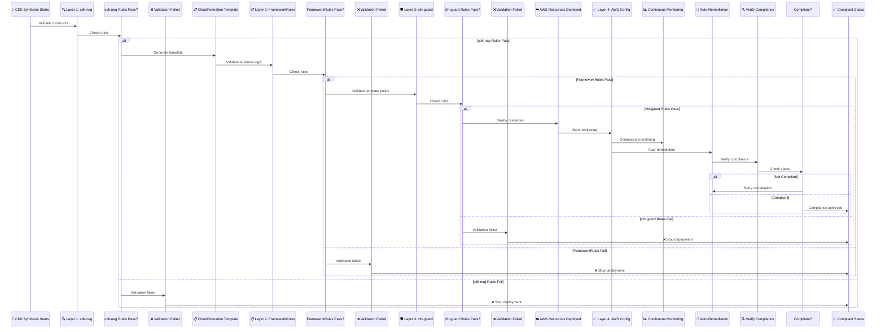
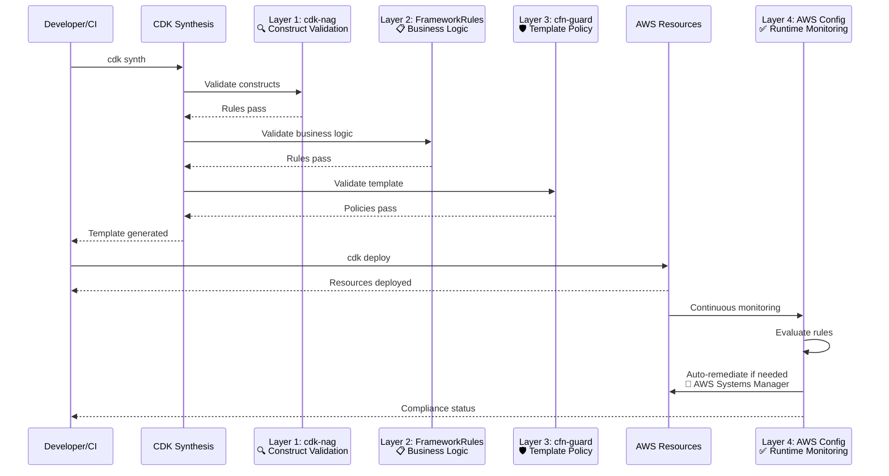

# Compliance Validation Architecture

## Overview

CloudForge CI implements a **4-layer defense-in-depth** validation approach to ensure infrastructure compliance across multiple frameworks (SOC2, HIPAA, PCI-DSS, GDPR). Each layer validates at a different stage of the deployment lifecycle.

## Multi-Layer Validation Flow



## Layer Details

### Layer 1: cdk-nag

**Purpose**: CDK construct-level validation using AWS best practices and security rules.

**What It Validates**:
- Security best practices (encryption, IAM policies)
- AWS Well-Architected Framework compliance
- Resource configuration (security groups, bucket policies)
- Construct-level violations

**Location**: Integrated into CDK synthesis

**Packs Used**:
- AwsSolutions
- HIPAA Security
- PCI DSS 3.2.1
- NIST 800-53

**Example Violations**:
- Missing encryption on EBS volumes
- Overly permissive IAM policies
- Public S3 buckets

### Layer 2: FrameworkRules

**Purpose**: CloudForge business logic validation using FrameworkRules implementations.

**What It Validates**:
- Compliance framework-specific requirements (SOC2, HIPAA, PCI-DSS, GDPR)
- Security profile enforcement
- Configuration validation (auth modes, network modes, etc.)
- Framework-specific rule combinations
- Business logic that can't be expressed in cdk-nag or cfn-guard

**Location**: `cloudforge-api/src/main/java/com/cloudforgeci/api/core/rules/`

**Framework Implementations**:
- `Soc2Rules` - SOC2 Trust Service Criteria validation
- `HipaaRules` - HIPAA Security Rule validation
- `PciDssRules` - PCI-DSS requirement validation
- `GdprRules` - GDPR technical measures validation
- `IamSecurityRules` - IAM policy validation
- `DatabaseSecurityRules` - Database security validation
- And more...

**Example Validation**:
```java
@Override
public void install(SystemContext ctx) {
    ctx.getNode().addValidation(() -> {
        // Validates HIPAA-specific requirements
        if (ctx.security == SecurityProfile.PRODUCTION) {
            validateEncryptionAtRest(ctx);
            validateAuditLogging(ctx);
            validateMfaEnforcement(ctx);
        }
    });
}
```

**Configuration**: Controlled by `auditManagerEnabled` flag in deployment context.

### Layer 3: cfn-guard

**Purpose**: CloudFormation template-level policy validation using CFN Guard rules.

**What It Validates**:
- IAM policy restrictions (no wildcard actions/resources)
- Resource configuration policies
- Compliance-specific rules (HIPAA, PCI-DSS, SOC2, GDPR)
- Template-level security controls

**Location**: `cloudforge-api/src/main/resources/cfn-guard/`

**Rule Files**:
- `frameworks/iam-security.guard` - IAM policy validation
- `frameworks/hipaa.guard` - HIPAA-specific rules
- `frameworks/pci-dss.guard` - PCI-DSS-specific rules
- `frameworks/soc2.guard` - SOC2-specific rules
- `frameworks/gdpr.guard` - GDPR-specific rules

**Example Rule**:
```guard
rule iam_security_policy_full_admin when
    resourceType in ['AWS::IAM::Policy'] {
    Properties.PolicyDocument.Statement[*] {
        when Effect == 'Allow' {
            Action != '*' <<Policies must not grant full administrator access>>
        }
    }
}
```

### Layer 4: AWS Config

**Purpose**: Runtime compliance monitoring and automatic remediation.

**What It Validates**:
- Continuous compliance checks on deployed resources
- Framework-specific Config rules:
  - **SOC2**: 16 rules (9 base + 7 SOC2-specific)
  - **HIPAA**: 17 rules (9 base + 8 HIPAA-specific)
  - **PCI-DSS**: 17 rules (9 base + 8 PCI-DSS-specific)
  - **GDPR**: 17 rules (9 base + 8 GDPR-specific)
  - **Multi-framework (all 4)**: 40 rules (9 base + 31 framework-specific)
- Automatic remediation via SSM Automation
- Compliance status tracking

**Location**: Deployed via ComplianceFactory

**Config Rules**:
- **Base rules (9)**: Encryption, IAM, S3, CloudTrail, VPC Flow Logs (always deployed)
- **Framework-specific rules**:
  - SOC2: 7 rules (total: 16 rules)
  - HIPAA: 8 rules (total: 17 rules)
  - PCI-DSS: 8 rules (total: 17 rules)
  - GDPR: 8 rules (total: 17 rules)
  - Multi-framework (all 4): 31 framework-specific rules (total: 40 rules)
- Custom remediation configurations

**Remediation Examples**:
- S3 versioning enforcement
- IAM password policy updates
- CloudTrail bucket access fixes
- RDS deletion protection

## Validation Pipeline



## Unit Testing (JUnit)

JUnit tests provide unit testing and compliance validation during development, but are not part of the runtime validation pipeline.

**Purpose**: Unit and integration tests validate configuration logic and business rules during development.

**What It Validates**:
- Field validation (required fields, enum values)
- Configuration logic (security profile requirements)
- Type conversions (String to Integer, etc.)
- Default value behavior
- Framework-specific requirements

**Location**: `cloudforge-api/src/test/java/`

**Coverage**: 263 parameterized test cases

**Example**:
```java
@Test
void testComplianceFrameworkIntegration() {
    // Validates that compliance frameworks affect resource deployment
    // Tests all combinations of frameworks, runtimes, security profiles
}
```

**Note**: JUnit tests run during development/CI, but are separate from the 4-layer runtime validation pipeline.

## Compliance Mode

CloudForge supports three compliance modes:

| Mode | Behavior | Use Case |
|------|----------|----------|
| **DISABLED** | No validation, warnings only | Development |
| **ADVISORY** | Log violations, don't block deployment | Staging |
| **ENFORCE** | Block deployment on violations | Production |

## Framework Coverage

| Framework | Config Rules | Test Coverage | Status |
|-----------|--------------|---------------|--------|
| **SOC2** | 16 rules | ✅ Fully tested | Production ready |
| **HIPAA** | 17 rules | ✅ 263 test cases | Production ready |
| **PCI-DSS** | 17 rules | ✅ Fully tested | Production ready |
| **GDPR** | 17 rules | ✅ Fully tested | Production ready |

## Related Documentation

- [Compliance Posture](../COMPLIANCE_POSTURE.md) - Overall compliance status
- [Automated Compliance](AUTOMATED_COMPLIANCE.md) - Auto-remediation features
- [Multi-Framework Compliance](MULTI_FRAMEWORK_COMPLIANCE.md) - Multiple frameworks
- [Testing Truth Tables](../testing/COMPLIANCE_TRUTH_TABLES.md) - Test coverage details

