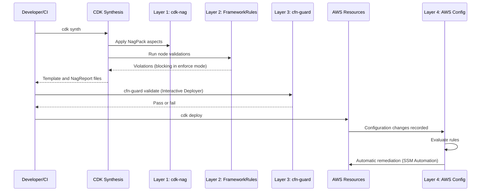

# Compliance Validation Architecture

## Overview

CloudForge CI checks infrastructure against compliance frameworks (SOC2, HIPAA, PCI-DSS, GDPR) in four layers. Each layer runs at a different stage of the deployment lifecycle and has its own enabling conditions.

| Layer | Tool | When it runs | Enabled by |
|-------|------|--------------|------------|
| 1 | cdk-nag | During `cdk synth` | `securityProfile: production` and at least one framework selected |
| 2 | CloudForge `FrameworkRules` | During `cdk synth` (CDK node validations) | `auditManagerEnabled: true` |
| 3 | cfn-guard | After synthesis, against the template | Interactive Deployer in `enforce` mode with frameworks selected; `TruthTableValidationTest` |
| 4 | AWS Config | After deployment | `awsConfigEnabled: true` |

## Multi-Layer Validation Flow



## Layer Details

### Layer 1: cdk-nag

**Purpose**: Construct-level checks from the cdk-nag rule packs.

**Location**: `SecurityRules.applyCdkNagValidation` in `cloudforge-api/src/main/java/com/cloudforgeci/api/core/rules/`.

**Packs Used**:

| Framework | Pack |
|-----------|------|
| HIPAA | `HIPAASecurityChecks` |
| PCI-DSS | `PCIDSS321Checks` |
| SOC2 | `AwsSolutionsChecks` |
| Other values | `AwsSolutionsChecks` |

Each pack writes JSON and CSV `NagReport` files. `app.synth()` does not fail on cdk-nag findings by itself. When synthesis runs through `CloudForgeSynthesizer` in `enforce` mode, it reads the reports through `NagReportReader` and fails when error-level findings are present; other entry points, such as the sample Interactive Deployer, leave the reports for review.

**Example Violations**:
- Missing encryption on EBS volumes
- Overly permissive IAM policies
- Public S3 buckets

### Layer 2: FrameworkRules

**Purpose**: CloudForge validators for framework-specific requirements that depend on deployment configuration, such as security profile, network mode, and authentication mode.

**Location**: `cloudforge-api/src/main/java/com/cloudforgeci/api/core/rules/`

Validators implement `FrameworkRules<SystemContext>`, are annotated with `@ComplianceFramework`, and are registered in `META-INF/services/com.cloudforge.core.interfaces.FrameworkRules`. `FrameworkLoader` discovers them with `ServiceLoader` and installs them in priority order: `alwaysLoad` validators always, other validators when their ID is in `complianceFrameworks`.

**Registered validators**:

| Class | ID | Priority | Loads |
|-------|----|----------|-------|
| `KeyManagementRules` | `KeyManagement` | -10 | always |
| `DatabaseSecurityRules` | `DatabaseSecurity` | -5 | always |
| `AdvancedMonitoringRules` | `AdvancedMonitoring` | -5 | always |
| `ThreatProtectionRules`, `IncidentResponseRules`, `ComputeSecurityRules`, `LambdaSecurityRules`, `CdnApiSecurityRules`, `ElbSecurityRules`, `MessagingSecurityRules`, `IamSecurityRules` | various | 0 | always |
| `HipaaRules` | `HIPAA` | 10 | `hipaa` selected |
| `HipaaOrganizationalRules` | `HIPAA-Organizational` | 15 | ID selected (not currently selectable) |
| `PciDssRules` | `PCI-DSS` | 20 | `pci-dss` selected |
| `GdprRules` | `GDPR` | 30 | `gdpr` selected |
| `GdprOrganizationalRules` | `GDPR-Organizational` | 35 | ID selected (not currently selectable) |
| `Soc2Rules` | `SOC2` | 40 | `soc2` selected |
| `Iso27001Rules` | `ISO-27001` | 50 | ID selected (not currently selectable) |

`ConfigurationValidationRules`, `FedRampRules`, and `FedRampHighRules` exist in the same package but are not registered, so they are not discovered. FedRAMP support is in development; see [FedRAMP Controls Mapping](FEDRAMP_CONTROLS_MAPPING.md).

**Example Validation**:
```java
@Override
public void install(SystemContext ctx) {
    if (ctx.security != SecurityProfile.PRODUCTION) {
        return;
    }
    ctx.getNode().addValidation(() -> {
        List<ComplianceRule> rules = new ArrayList<>();
        rules.addAll(validateEncryption(ctx));
        rules.addAll(validateAuditLogging(ctx));
        // Failed rules become CDK validation errors in enforce mode
        // and warnings in advisory mode.
        ...
    });
}
```

**Adding a framework**: implement `FrameworkRules<SystemContext>`, annotate the class with `@ComplianceFramework`, and list it in a `META-INF/services/com.cloudforge.core.interfaces.FrameworkRules` file on the classpath. The sample project registers `CustomSecurityPolicyRules` and `OpenSourceSecurityPolicyRules` this way in `cfc-testing/src/main/resources/META-INF/services/`.

### Layer 3: cfn-guard

**Purpose**: Template-level policy checks with [AWS CloudFormation Guard](https://github.com/aws-cloudformation/cloudformation-guard).

**Location**: `cloudforge-api/src/main/resources/cfn-guard/frameworks/`

**Rule Files**:
- Cross-framework: `iam-security.guard`, `compute-security.guard`, `lambda-security.guard`, `cdn-api-security.guard`, `elb-security.guard`, `database-security.guard`, `messaging-security.guard`, `key-management.guard`, `advanced-monitoring.guard`, `threat-protection.guard`, `incident-response.guard`, `iso-27001-controls.guard`
- Framework-specific: `soc2-trust-services.guard`, `pci-dss-v4.0.1.guard`, `hipaa-security-rule.guard`, `gdpr-data-protection.guard`

The Interactive Deployer runs the cross-framework files plus the files for the selected frameworks against `cdk.out/<stackName>.template.json` when `complianceMode` is `enforce`, and stops before deploying if any fail. It skips this layer when the `cfn-guard` binary is not installed. `TruthTableValidationTest` runs the same rules in the test suite.

**Example Rule** (`iam-security.guard`):
```guard
rule iam_security_policy_full_admin when
    resourceType in ['AWS::IAM::Policy'] {
    Properties.PolicyDocument.Statement[*] {
        when Effect == 'Allow' {
            Action != '*' <<Policies must not grant full administrator access>>
        }
    }
}
```

### Layer 4: AWS Config

**Purpose**: Evaluation of deployed resources and automatic remediation.

**Location**: `ComplianceFactory` in `cloudforge-api/src/main/java/com/cloudforgeci/api/observability/`

**Config Rules**:
- **Base rules**: encryption (EBS, S3), S3 public access and versioning, IAM password policy, CloudTrail
- **Framework-specific rules**: deployed under CloudFormation conditions for each selected framework; database rules also require `provisionDatabase`
- **Collected rules**: registered by other factories only for resources that are created
- **Conformance packs**: deployed for selected frameworks

**Remediation Examples**:
- IAM password policy updates
- S3 versioning enforcement (`enableS3VersioningRemediation`)
- CloudTrail bucket access fixes (`enableCloudTrailBucketAccessRemediation`)
- RDS deletion protection (`enableRdsDeletionProtectionRemediation`)

See [Automated Compliance](AUTOMATED_COMPLIANCE.md) and [Retained Resources](RETAINED_RESOURCES.md#aws-config-auto-remediation) for the full list.

## Unit and Integration Tests

JUnit tests validate configuration logic and rule behavior during development and CI. They are separate from the four runtime layers.

**What they cover**:
- Field validation (required fields, enum values)
- Configuration logic (security profile requirements)
- Default value behavior
- Framework-specific rule outcomes, including the CSV-driven matrix in `TruthTableValidationTest`

**Location**: `cloudforge-api/src/test/java/`

See [CSV Parameterized Testing](CSV_PARAMETERIZED_TESTING.md) and [Compliance Truth Tables](../testing/COMPLIANCE_TRUTH_TABLES.md).

## Compliance Mode

| Mode | Behavior | Default for |
|------|----------|-------------|
| **ENFORCE** | Framework validator failures block synthesis; cdk-nag errors block when synthesizing through `CloudForgeSynthesizer`; the Interactive Deployer also runs cfn-guard | `production` |
| **ADVISORY** | Violations are logged as warnings; deployment continues | `dev`, `staging` |
| **DISABLED** | `ComplianceMatrix` does not force framework-required controls on. The PCI-DSS, HIPAA, SOC2, and GDPR validators currently treat it like `enforce`; disable them with `auditManagerEnabled: false` | none |

## Framework Coverage

| Framework | Validators | cdk-nag Pack | cfn-guard File | Test Matrix |
|-----------|-----------|--------------|----------------|-------------|
| **SOC2** | `Soc2Rules` | `AwsSolutionsChecks` | `soc2-trust-services.guard` | `compliance-matrices/soc2_*` |
| **HIPAA** | `HipaaRules` | `HIPAASecurityChecks` | `hipaa-security-rule.guard` | `compliance-matrices/hipaa_*` |
| **PCI-DSS** | `PciDssRules` | `PCIDSS321Checks` | `pci-dss-v4.0.1.guard` | `compliance-matrices/pci-dss_*` |
| **GDPR** | `GdprRules` | `AwsSolutionsChecks` | `gdpr-data-protection.guard` | `compliance-matrices/gdpr_*` |

Passing these checks shows that the configured controls match the encoded rules. It is not a certification or audit opinion.

## Related Documentation

- [Compliance Posture](../COMPLIANCE_POSTURE.md) - Coverage by framework
- [Automated Compliance](AUTOMATED_COMPLIANCE.md) - Remediation features
- [Multi-Framework Compliance](MULTI_FRAMEWORK_COMPLIANCE.md) - Multiple frameworks
- [Compliance Truth Tables](../testing/COMPLIANCE_TRUTH_TABLES.md) - Test coverage details
