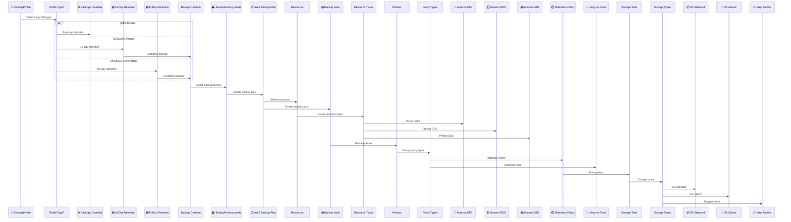
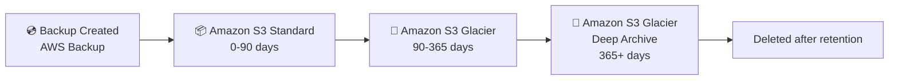

# Backup & Disaster Recovery Architecture

## Overview

CloudForge CI provides automated backup and disaster recovery capabilities using AWS Backup. Backup policies are automatically configured based on security profiles, ensuring data protection while optimizing costs.

## Backup Flow



## Security Profile Configuration

### DEV Profile

**Backup Settings**:
- **Enabled**: `false` (disabled)
- **Retention**: 0 days
- **Cross-Region**: Disabled

**Rationale**: Development environments prioritize cost savings over data protection. Data can be recreated from source code.

### STAGING Profile

**Backup Settings**:
- **Enabled**: `true` (automatic)
- **Retention**: 14 days
- **Cross-Region**: Disabled
- **Vault Lock**: Disabled

**Rationale**: Staging environments need short-term backups for testing and rollback scenarios, but don't require long-term retention.

### PRODUCTION Profile

**Backup Settings**:
- **Enabled**: `true` (automatic)
- **Retention**: 90 days
- **Cross-Region**: Enabled
- **Vault Lock**: Enabled (prevents deletion)

**Rationale**: Production environments require comprehensive backup protection with cross-region disaster recovery capabilities.

## Backup Resources

### Amazon EFS

**What's Backed Up**:
- Application data files
- Configuration files
- User uploads
- Shared storage content

**Backup Frequency**: Daily at 2:00 AM UTC

**Retention**:
- DEV: Not backed up
- STAGING: 14 days
- PRODUCTION: 90 days (with cross-region copy)

### Amazon RDS

**What's Backed Up**:
- Database snapshots
- Transaction logs
- Point-in-time recovery data

**Backup Frequency**: 
- Automated daily snapshots
- Continuous transaction log backups

**Retention**:
- DEV: Not backed up (uses RDS automated backups only)
- STAGING: 14 days
- PRODUCTION: 90 days (with cross-region copy)

**Note**: RDS also maintains its own automated backups (7 days) independent of AWS Backup.

### Amazon EBS (EC2 Only)

**What's Backed Up**:
- EBS volume snapshots
- Root volumes
- Data volumes

**Backup Frequency**: Daily at 2:00 AM UTC

**Retention**:
- DEV: Not backed up
- STAGING: 14 days
- PRODUCTION: 90 days (with cross-region copy)

## Backup Vault

### Vault Configuration

**Purpose**: Centralized storage for all backup copies.

**Features**:
- Encryption at rest (AWS KMS)
- Access control via IAM policies
- Backup lifecycle management
- Compliance tagging

### Vault Lock (Production Only)

**Purpose**: Prevent accidental or malicious deletion of backups.

**Configuration**:
- Enabled for PRODUCTION profile only
- Immutable backup retention
- Compliance requirement (SOC2, HIPAA)

**Impact**: Once enabled, backups cannot be deleted until retention period expires, even by administrators.

## Cross-Region Backup Copy

### Production Feature

**Purpose**: Disaster recovery protection against regional outages.

**Configuration**:
- Enabled for PRODUCTION profile only
- Copies backups to secondary region
- Automatic replication
- Same retention policy as primary region

**Cost**: Additional storage and transfer costs (~$0.01/GB/month for storage, $0.02/GB for transfer)

**Regions**: 
- Primary: Deployment region
- Secondary: Automatically selected (different region in same country/continent)

## Backup Lifecycle



### Lifecycle Transitions

**Day 0-90**: S3 Standard storage
- Immediate access
- Higher cost ($0.023/GB/month)
- Suitable for recent backups

**Day 90-365**: Glacier storage
- 3-5 hour retrieval time
- Lower cost ($0.004/GB/month)
- Suitable for monthly backups

**Day 365+**: Glacier Deep Archive
- 12 hour retrieval time
- Lowest cost ($0.00099/GB/month)
- Suitable for long-term compliance retention

## Restore Process

### Point-in-Time Recovery

**RDS**:
1. Select restore point (within retention window)
2. Create new RDS instance from backup
3. Update application connection strings
4. Verify data integrity

**EFS**:
1. Select backup snapshot
2. Create new EFS from backup
3. Update application mount points
4. Verify file integrity

**EBS**:
1. Select volume snapshot
2. Create new EBS volume from snapshot
3. Attach to EC2 instance
4. Mount and verify

### Disaster Recovery Scenario

**Regional Outage**:
1. Access cross-region backups
2. Restore resources in secondary region
3. Update DNS/Route 53 to point to new region
4. Verify application functionality
5. Monitor for issues

**Estimated Recovery Time**: 2-4 hours (depending on data size)

## Cost Optimization

### Storage Tiering

**Cost Savings**: Up to 95% reduction vs. keeping all backups in S3 Standard

**Example** (1 TB of backups over 1 year):
- S3 Standard only: $276/year
- With lifecycle: $96/year
- **Savings**: $180/year (65% reduction)

### Backup Selection

**DEV**: No backups = $0/month
**STAGING**: 14-day retention = ~$5-10/month
**PRODUCTION**: 90-day retention + cross-region = ~$20-50/month

## Configuration

### Enable/Disable Backups

```json
{
  "securityProfile": "production",
  "automatedBackupEnabled": true,
  "backupRetentionDays": 90,
  "crossRegionBackupEnabled": true
}
```

### Custom Retention

Override default retention per security profile:

```json
{
  "securityProfile": "staging",
  "backupRetentionDays": 30
}
```

## Monitoring

### CloudWatch Metrics

**Backup Metrics**:
- Number of backups
- Backup size
- Backup success/failure rate
- Restore time

### Alarms

**Configured Alarms**:
- Backup failure notification
- Backup vault near capacity
- Restore operation failure

## Related Documentation

- [Deployment Architecture](DEPLOYMENT_ARCHITECTURE.md) - Overall deployment flow
- [Database Deployment Guide](../databases/DATABASE-DEPLOYMENT-GUIDE.md) - RDS backup details
- [Compliance Frameworks](../compliance/MULTI_FRAMEWORK_COMPLIANCE.md) - Backup requirements

