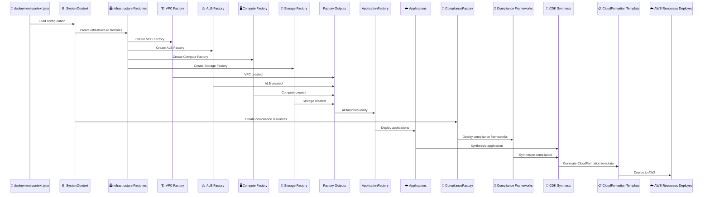
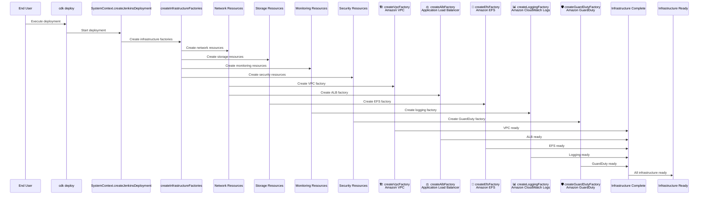
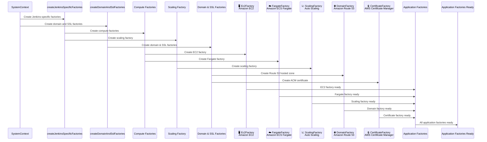
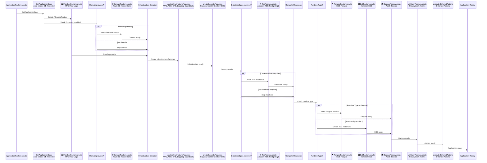
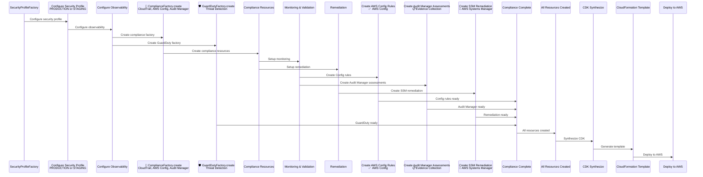

# Deployment Architecture

## Overview

CloudForge CI uses a modular, factory-based architecture to orchestrate AWS infrastructure deployment. This document describes both the conceptual high-level flow and the actual code implementation flow.

:::tip Architecture Pattern
All factories follow a consistent pattern: **Constructor** → **create()** → **Context Injection**. This ensures consistent resource naming, proper dependency management, and testability through dependency injection.
:::

## Conceptual Deployment Flow

The high-level deployment process follows this flow:



## Actual Code Flow

The implementation follows this detailed flow using actual SystemContext methods. The flow is broken into focused sections for better readability:

### Phase 1: Initial Setup and Infrastructure



**Code Example - Infrastructure Factory Creation**:

```java
public InfrastructureFactories createInfrastructureFactories(Construct scope, String idPrefix) {
    // Create infrastructure factories in dependency order
    VpcFactory vpcFactory = createVpcFactory(scope, idPrefix);
    AlbFactory albFactory = createAlbFactory(scope, idPrefix);
    EfsFactory efsFactory = createEfsFactory(scope, idPrefix);
    LoggingCwFactory loggingFactory = createLoggingFactory(scope, idPrefix);
    
    // Create GuardDuty threat detection (account-level service)
    createGuardDutyFactory(scope, idPrefix);
    
    return new InfrastructureFactories(vpcFactory, albFactory, efsFactory, loggingFactory);
}
```

### Phase 2: Application-Specific Factories



### Phase 3: Application Factory Flow



**Code Example - Application Factory Complete Flow**:

```java
@Override
public void create() {
    // Set ApplicationSpec (must be done before createInfrastructureFactories)
    ctx.applicationSpec.set(applicationSpec);
    
    // Create FlowLogFactory early
    FlowLogFactory flowLogFactory = new FlowLogFactory(this, id + "Flowlog");
    flowLogFactory.create();
    
    // Create domain factory if domain is provided
    if (domain != null && !domain.isBlank()) {
        DomainFactory domainFactory = new DomainFactory(this, id + "Domain");
        domainFactory.create();
    }
    
    // Create infrastructure factories FIRST (VPC, ALB, EFS, Logging)
    infrastructure = ctx.createInfrastructureFactories(this, id);
    
    // Create security factories AFTER infrastructure factories
    // (Cognito needs ALB DNS name for callback URLs)
    ctx.createSecurityFactories(this, id);
    
    // Provision database if required (VPC must exist)
    if (applicationSpec instanceof DatabaseSpec) {
        DatabaseSpec dbSpec = (DatabaseSpec) applicationSpec;
        if (shouldProvisionDatabase) {
            DatabaseConnection dbConnection = RdsFactory.createDatabase(...);
            ctx.dbConnection.set(dbConnection);
        }
    }
    
    // Create compute resources (Fargate or EC2)
    if (runtime == RuntimeType.FARGATE) {
        FargateFactory fargate = new FargateFactory(this, id + "Fargate");
        fargate.create();
    } else if (runtime == RuntimeType.EC2) {
        Ec2Factory ec2 = new Ec2Factory(this, id + "Ec2");
        ec2.create();
    }
    
    // Create backup and alarms
    BackupFactory backupFactory = new BackupFactory(this, id + "Backup");
    backupFactory.create();
    
    new AlarmFactory(this, id + "Alarms", null);
    
    // Execute deferred actions
    ctx.executeDeferredActions();
}
```

### Phase 4: Security Profile Configuration and Compliance



:::info ComplianceFactory Creation
**ComplianceFactory is created by SecurityProfileFactory** (ProductionSecurityConfiguration or StagingSecurityConfiguration), not directly by SystemContext or ApplicationFactory. This ensures compliance resources are created at the security profile level, not per-application.
:::

:::warning Deployment Order
Infrastructure factories **must** be created before application factories. The VPC must exist before RDS can be provisioned, and the ALB must exist before security factories can reference it for OIDC callback URLs.
:::

## Component Responsibilities

### SystemContext

The main orchestration layer that:
- Creates infrastructure factories (VPC, ALB, EFS, Logging)
- Creates application-specific factories (Jenkins, S3/CloudFront)
- Creates domain and SSL factories
- Coordinates dependencies between components
- Provides context injection to all factories

**Code Example - SystemContext Initialization**:

```java
public SystemContext(DeploymentContext deploymentContext) {
    this.deploymentContext = deploymentContext;
    this.runtime = deploymentContext.getRuntime();
    this.securityProfile = deploymentContext.getSecurityProfile();
    // ... additional initialization
}
```

### ApplicationFactory

Handles application deployment with the following execution order:

1. **Initial Setup**: Sets ApplicationSpec, auto-enables database if needed for capacity
2. **Flow Logs**: Creates FlowLogFactory early to configure VPC Flow Logs
3. **Domain**: Creates DomainFactory if domain is provided (needed for SSL certificate validation)
4. **Infrastructure**: Creates VPC, ALB, EFS, Logging, GuardDuty via `createInfrastructureFactories()`
5. **Security**: Creates Cognito, Identity Center, OIDC via `createSecurityFactories()` (requires ALB to exist)
6. **Database**: Provisions RDS if required by ApplicationSpec (requires VPC to exist)
7. **Compute**: Creates Fargate or EC2 compute resources
8. **Backup**: Creates BackupFactory for data protection
9. **Alarms**: Creates AlarmFactory for CloudWatch monitoring
10. **Deferred Actions**: Executes deferred actions via `executeDeferredActions()`

:::tip ApplicationSpec Pattern
Each application has an `ApplicationSpec` that defines its requirements (database, ports, storage). The factory loads the spec and provisions resources accordingly.
:::

:::warning Execution Order
The order matters! FlowLogFactory must be created first, infrastructure before security (ALB needed for OIDC callbacks), and VPC before database provisioning.
:::

### ComplianceFactory

Manages compliance framework enforcement. **Created by SecurityProfileFactory** (not directly by SystemContext):

- Creates CloudTrail for audit logging
- Creates AWS Config rules based on enabled frameworks (9 base + 7-8 per framework)
- Sets up auto-remediation via SSM Automation
- Configures S3 lifecycle policies for log retention
- Enforces IAM password policies
- Creates Audit Manager assessments for evidence collection

**Creation Location**: `ProductionSecurityConfiguration.configureObservability()` or `StagingSecurityConfiguration.configureObservability()`

:::note Compliance Validation
Compliance validation runs at **build time** (during CDK synthesis) and **runtime** (via AWS Config). Deployment fails if required controls are missing.
:::

:::info Security Profile Integration
ComplianceFactory is created at the security profile level, ensuring compliance resources are shared across all applications in the same security profile, not duplicated per-application.
:::

## Factory Pattern

All factories follow a consistent pattern:

1. **Constructor**: Takes scope and ID, injects DeploymentContext
2. **create()**: Main method that creates AWS resources
3. **Context Injection**: Uses SystemContext slots for dependency injection

**Code Example - Factory Pattern**:

```java
public class VpcFactory extends BaseFactory {
    public VpcFactory(Construct scope, String id) {
        super(scope, id);
        // DeploymentContext is injected via BaseFactory
    }
    
    @Override
    public void create() {
        Vpc vpc = Vpc.Builder.create(this, "Vpc")
            .maxAzs(2)
            .natGateways(deploymentContext.getNetworkMode() == NetworkMode.PRIVATE_WITH_NAT ? 1 : 0)
            .build();
    }
}
```

This pattern ensures:
- **Consistent resource naming**: All resources follow the same naming convention
- **Proper dependency management**: Dependencies are injected, not hardcoded
- **Testability**: Factories can be tested in isolation with mock contexts
- **Extensibility**: New applications and compliance frameworks can be added easily

## Key Takeaways

:::info Architecture Benefits
- **Modular Design**: Each factory is independent and testable
- **Dependency Injection**: Context is injected, not hardcoded
- **Consistent Pattern**: All factories follow the same structure
- **Extensible**: Easy to add new applications and compliance frameworks
:::

## Common Pitfalls

:::danger Avoid These Mistakes
1. **Creating factories out of order**: Infrastructure factories must be created before application factories
2. **Missing dependencies**: Ensure VPC exists before creating RDS
3. **Hardcoding values**: Always use DeploymentContext for configuration
4. **Skipping validation**: Compliance validation runs at build time - don't disable it
:::

## Related Documentation

- [Interactive Deployer](INTERACTIVE_DEPLOYER.md) - User-facing deployment tool
- [Network Architecture](NETWORK_ARCHITECTURE.md) - VPC and network topology
- [Compliance Validation](../compliance/VALIDATION_ARCHITECTURE.md) - Multi-layer validation
- [Plugin System](../plugins/PLUGIN-SYSTEM.md) - Extending with custom plugins


