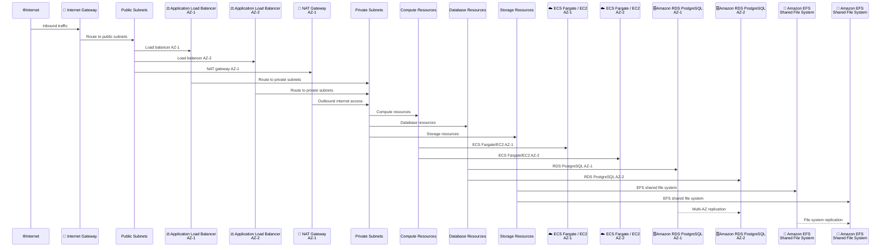

# Network Architecture

## Overview

CloudForge CI deploys applications in a secure, multi-AZ VPC architecture with public and private subnets. This design ensures high availability, network isolation, and compliance with security best practices.

## VPC Topology



## Network Components

### Public Subnets

**Purpose**: Host resources that need direct internet access.

**Components**:
- **Application Load Balancer (ALB)**: Routes traffic to private subnets
- **NAT Gateway**: Provides outbound internet access for private subnets
- **Internet Gateway**: Connects VPC to internet

**Security**:
- Security groups restrict inbound traffic to ALB only
- No direct access to application instances
- ALB handles SSL/TLS termination

**Code Example - VPC Factory**:

```java
public final class VpcFactory extends BaseFactory {
    @SystemContext("networkMode")
    private NetworkMode networkMode;
    
    @SystemContext("securityProfile")
    private SecurityProfile securityProfile;
    
    @Override
    public void create() {
        // Determine NAT gateway count based on network mode and security profile
        int natGateways = calculateNatGatewayCount();
        
        Vpc vpc = Vpc.Builder.create(this, "Vpc")
            .maxAzs(2)  // Multi-AZ for high availability
            .natGateways(natGateways)
            .build();
        
        // Enable VPC Flow Logs for production/staging
        if (securityProfile != SecurityProfile.DEV) {
            enableFlowLogs(vpc);
        }
    }
}
```

### Private Subnets

**Purpose**: Host application and data resources with no direct internet access.

**Components**:
- **ECS/Fargate or EC2**: Application compute instances
- **Amazon RDS**: Database instances (Multi-AZ for high availability)
- **Amazon EFS**: Shared file storage for application data

**Security**:
- No public IP addresses
- Outbound internet via NAT Gateway only
- Security groups enforce least-privilege access
- VPC Flow Logs enabled for network monitoring

## Network Modes

CloudForge supports two network configurations:

| Feature | Public-No-NAT | Private-With-NAT |
|---------|---------------|------------------|
| **Subnet Type** | Public subnets | Private subnets |
| **Internet Access** | Direct | Via NAT Gateway |
| **Security Level** | Lower | Higher |
| **Cost** | Lower (~$0/month) | Higher (~$32/month) |
| **Compliance** | DEV/STAGING only | Required for HIPAA/PCI-DSS |
| **Use Case** | Development, testing | Production, compliance |

### Public-No-NAT Mode

**Use Case**: Development and testing environments

**Configuration**:
- Applications in public subnets
- Direct internet access
- Lower cost (no NAT Gateway)
- Less secure

**When to Use**:
- Development environments
- Non-sensitive applications
- Cost-sensitive deployments

:::tip Cost Optimization
Public-No-NAT mode saves approximately **$32/month** by eliminating the NAT Gateway. Use this for development and testing environments where security requirements are lower.
:::

### Private-With-NAT Mode

**Use Case**: Production and compliance-required environments

**Configuration**:
- Applications in private subnets
- Internet access via NAT Gateway
- Higher security
- Higher cost (~$32/month for NAT Gateway)

**When to Use**:
- Production deployments
- HIPAA compliance (required)
- PCI-DSS compliance (required)
- SOC2 compliance (recommended)

:::warning Compliance Requirement
**HIPAA** and **PCI-DSS** compliance **require** Private-With-NAT mode. Applications must be in private subnets with no direct internet access.
:::

## Security Groups

### ALB Security Group

**Inbound Rules**:
- Port 80 (HTTP) from 0.0.0.0/0
- Port 443 (HTTPS) from 0.0.0.0/0

**Outbound Rules**:
- All traffic to application security group

### Application Security Group

**Inbound Rules**:
- Port 8080 (or application port) from ALB security group only
- Port 22 (SSH) from bastion CIDR (production only)

**Outbound Rules**:
- Port 443 to 0.0.0.0/0 (HTTPS for package downloads)
- Port 80 to 0.0.0.0/0 (HTTP for package downloads)
- All traffic to RDS security group
- All traffic to EFS security group

### RDS Security Group

**Inbound Rules**:
- Port 5432 (PostgreSQL) from application security group only

**Outbound Rules**:
- None (RDS doesn't initiate connections)

### EFS Security Group

**Inbound Rules**:
- Port 2049 (NFS) from application security group only

**Outbound Rules**:
- None (EFS doesn't initiate connections)

## High Availability

### Multi-AZ Deployment

All critical components are deployed across multiple Availability Zones:

- **ALB**: Automatically distributes across AZs
- **Application Instances**: Deployed in multiple AZs with auto-scaling
- **RDS**: Multi-AZ with automatic failover
- **EFS**: Automatically replicated across AZs

:::tip High Availability
Multi-AZ deployment ensures **99.99% availability** (4 nines) for production workloads. Single-AZ deployments are only recommended for development environments.
:::

### Auto-Scaling

Application instances scale based on:
- CPU utilization (default: 60% target)
- Memory utilization
- Custom CloudWatch metrics

**Scaling Configuration**:
- Minimum instances: 1 (or 2 for production)
- Maximum instances: Configurable (default: 4)
- Scaling policies: Target tracking

:::note Production Recommendations
For production deployments, set **minimum instances to 2** to ensure high availability even during scaling events.
:::

## Network Monitoring

### VPC Flow Logs

**Purpose**: Network traffic monitoring for security and compliance.

**Configuration**:
- Enabled for production and staging profiles
- Logs sent to CloudWatch Logs
- Retention: Based on compliance framework (1-6 years)

**Use Cases**:
- Security incident investigation
- Network troubleshooting
- Compliance auditing (HIPAA, PCI-DSS)

### CloudWatch Network Metrics

**Monitored Metrics**:
- NetworkIn/NetworkOut (bytes)
- PacketsIn/PacketsOut
- ALB request count and latency
- Target response time

## DNS and Domain Configuration

### Route 53 Integration

**Optional Configuration**:
- Custom domain (e.g., `jenkins.example.com`)
- SSL certificate via ACM
- Route 53 hosted zone creation

**Without Domain**:
- Uses ALB DNS name (e.g., `my-alb-123456789.us-east-1.elb.amazonaws.com`)
- Can use AWS Private CA for SSL (development)

:::tip Domain Configuration
While custom domains are optional, they provide:
- **Professional appearance**: `app.example.com` vs. `my-alb-123456789.us-east-1.elb.amazonaws.com`
- **SSL/TLS**: Automatic certificate provisioning via ACM
- **DNS management**: Centralized DNS configuration in Route 53
:::

## Related Documentation

- [Deployment Architecture](DEPLOYMENT_ARCHITECTURE.md) - Overall deployment flow
- [Security Rules](SECURITY_RULES_README.md) - Security configuration
- [Compliance Frameworks](../compliance/MULTI_FRAMEWORK_COMPLIANCE.md) - Compliance requirements

