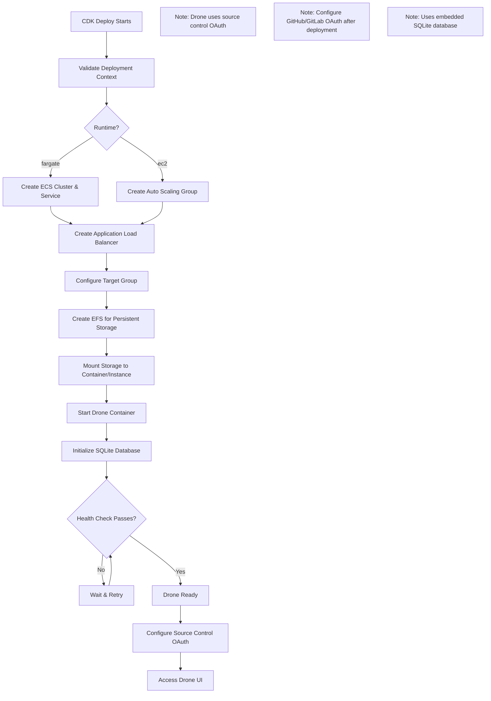
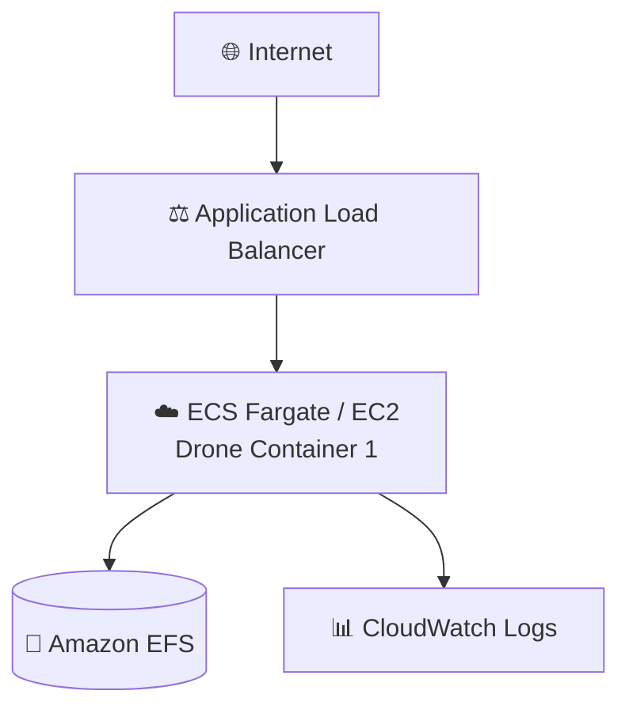

# Drone Application Guide

Drone is a container-native, continuous delivery platform that uses a simple YAML configuration to define and execute pipelines.

**Status**: Available (Not Yet Tested)

---

## Quick Reference

| Property | Value |
|----------|-------|
| **Application ID** | `drone` |
| **Category** | CI/CD |
| **Default Image** | `drone/drone:2` |
| **Application Port** | `80` |
| **Default CPU** | 1024 (Fargate) |
| **Default Memory** | 2048 MB (Fargate) |
| **Default Instance** | t3.small (EC2) |
| **Health Check Path** | `/` |
| **Health Check Grace** | 300 seconds |
| **Supports Fargate** | Yes |
| **Supports EC2** | Yes |
| **OIDC Support** | No (use source control OAuth) |
| **Database Required** | No (embedded SQLite) |

---

## Deployment Architecture

The following AWS architecture diagram shows the complete Drone deployment:



## Architecture Diagram

The following diagram shows the Drone deployment architecture:



---

## Capabilities

- Pipeline as code (.drone.yml)
- Container-native builds
- GitHub, GitLab, Bitbucket integration
- Multi-platform builds (Linux, Windows, ARM)
- Plugin ecosystem
- Secrets management
- Cron scheduling
- Parallelized steps
- Matrix builds

---

## Storage Configuration

### Container (Fargate)
| Property | Value |
|----------|-------|
| Data Path | `/data` |
| EFS Path | `/drone` |
| Volume Name | `droneData` |
| Container User | `1000:1000` |
| EFS Permissions | `755` |

---

## Deployment Context Examples

### Development

```json
{
  "stackName": "Drone-Dev",
  "applicationId": "drone",
  "applicationName": "Drone CI",
  "description": "Drone CI development server",
  "environment": "development",

  "runtime": "fargate",
  "securityProfile": "dev",
  "topology": "application-service",

  "networkMode": "public-no-nat",
  "region": "us-east-1",

  "authMode": "none",

  "cpu": 1024,
  "memory": 2048,

  "enableMonitoring": true,
  "logRetentionDays": "7"
}
```

**Cost estimate:** ~$50/month

### Production

```json
{
  "stackName": "Drone-Production",
  "applicationId": "drone",
  "applicationName": "Drone CI",
  "description": "Production Drone CI",
  "environment": "production",

  "runtime": "ec2",
  "securityProfile": "production",
  "topology": "application-service",

  "domain": "example.com",
  "subdomain": "ci",
  "enableSsl": true,

  "networkMode": "private-with-nat",
  "region": "us-east-1",

  "authMode": "alb-oidc",
  "cognitoAutoProvision": true,
  "cognitoDomainPrefix": "drone-prod-yourcompany",
  "cognitoMfaEnabled": true,

  "instanceType": "t3.small",
  "minInstanceCapacity": 1,
  "maxInstanceCapacity": 2,

  "complianceFrameworks": "SOC2",
  "awsConfigEnabled": true,
  "wafEnabled": true,

  "enableMonitoring": true,
  "enableEncryption": true,
  "logRetentionDays": "730",
  "retainStorage": true
}
```

**Cost estimate:** ~$150/month

---

## Post-Deployment Tasks

1. Configure OAuth with GitHub/GitLab
2. Set environment variables for OAuth credentials
3. Activate repositories
4. Add `.drone.yml` to repositories

---

## Related Documentation

- [Drone Documentation](https://docs.drone.io/)
