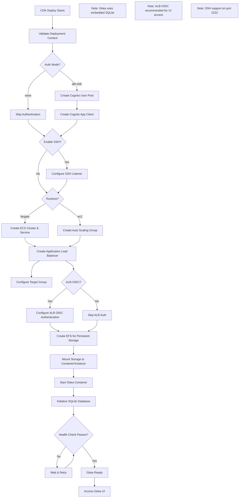
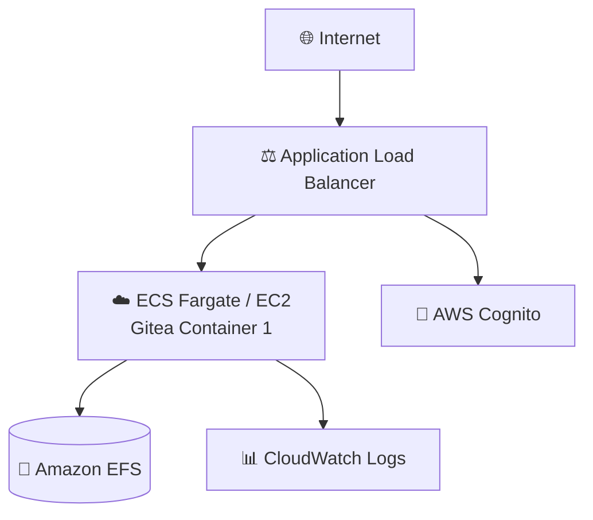

# Gitea Application Guide

Gitea is a lightweight, self-hosted Git service written in Go. It provides a simple, fast, and painless way to set up a self-hosted code hosting solution.

**Status**: Available (Not Yet Tested)

---

## Quick Reference

| Property | Value |
|----------|-------|
| **Application ID** | `gitea` |
| **Category** | Version Control |
| **Default Image** | `gitea/gitea:latest` |
| **Application Port** | `3000` |
| **SSH Port** | `22` (remapped to 2222) |
| **Default CPU** | 512 (Fargate) |
| **Default Memory** | 1024 MB (Fargate) |
| **Default Instance** | t3.micro (EC2) |
| **Health Check Path** | `/` |
| **Health Check Grace** | 300 seconds |
| **Supports Fargate** | Yes |
| **Supports EC2** | Yes |
| **OIDC Support** | No (use ALB-OIDC) |
| **Database Required** | No (embedded SQLite) |

---

## Deployment Architecture

The following AWS architecture diagram shows the complete Gitea deployment:



## Architecture Diagram

The following diagram shows the Gitea deployment architecture:



---

## Capabilities

- Git repository hosting
- Pull request workflow
- Issue tracking
- Wiki documentation
- Organizations and teams
- Webhooks
- Git LFS support
- Repository mirroring
- Package registry (npm, Maven, Container, etc.)
- Actions (CI/CD, GitHub Actions compatible)

---

## Optional Ports

| Port | Protocol | Direction | Feature Flag | Description |
|------|----------|-----------|--------------|-------------|
| 2222 | TCP | Inbound | `enableSsh` | Git SSH |

**Example enabling SSH:**
```json
{
  "enableSsh": true
}
```

---

## Authentication

| Mode | Status | Description |
|------|--------|-------------|
| `alb-oidc` | Available | ALB-level authentication |
| `none` | Available | Local accounts only |

**Note:** Gitea supports OIDC natively but CloudForge integration is pending.

---

## Storage Configuration

### Container (Fargate)
| Property | Value |
|----------|-------|
| Data Path | `/data` |
| EFS Path | `/gitea` |
| Volume Name | `giteaData` |
| Container User | `1000:1000` |
| EFS Permissions | `755` |

---

## Deployment Context Examples

### Development

```json
{
  "stackName": "Gitea-Dev",
  "applicationId": "gitea",
  "applicationName": "Gitea Dev",
  "description": "Gitea development git server",
  "environment": "development",

  "runtime": "fargate",
  "securityProfile": "dev",
  "topology": "application-service",

  "networkMode": "public-no-nat",
  "region": "us-east-1",

  "authMode": "none",

  "cpu": 512,
  "memory": 1024,

  "enableSsh": true,

  "enableMonitoring": true,
  "logRetentionDays": "7"
}
```

**Cost estimate:** ~$30/month

### Production

```json
{
  "stackName": "Gitea-Production",
  "applicationId": "gitea",
  "applicationName": "Gitea",
  "description": "Production Gitea git server",
  "environment": "production",

  "runtime": "ec2",
  "securityProfile": "production",
  "topology": "application-service",

  "domain": "example.com",
  "subdomain": "git",
  "enableSsl": true,

  "networkMode": "private-with-nat",
  "region": "us-east-1",

  "authMode": "alb-oidc",
  "cognitoAutoProvision": true,
  "cognitoDomainPrefix": "gitea-prod-yourcompany",
  "cognitoMfaEnabled": true,

  "instanceType": "t3.small",
  "minInstanceCapacity": 1,
  "maxInstanceCapacity": 2,

  "enableSsh": true,

  "complianceFrameworks": "SOC2",
  "awsConfigEnabled": true,
  "wafEnabled": true,

  "enableMonitoring": true,
  "enableEncryption": true,
  "logRetentionDays": "730",
  "retainStorage": true
}
```

**Cost estimate:** ~$150/month

---

## Post-Deployment Tasks

1. Navigate to Gitea URL
2. Complete initial setup wizard
3. Create admin account
4. Configure SSH (if enabled)
5. Create organizations and repositories

---

## Related Documentation

- [Gitea Documentation](https://docs.gitea.io/)
