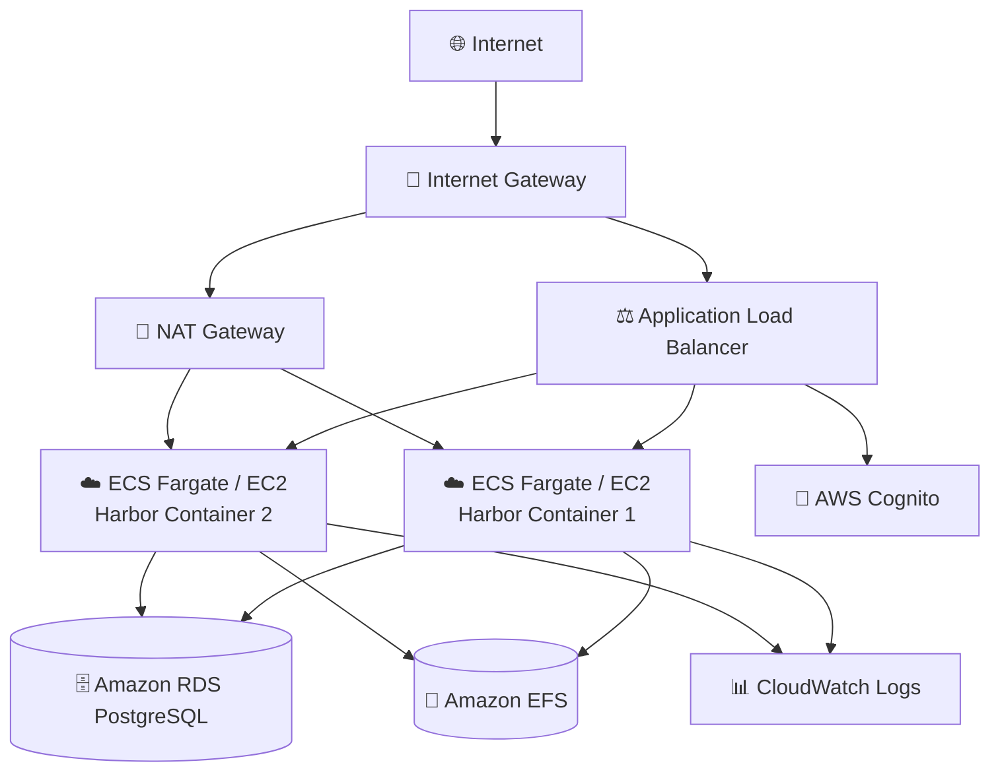
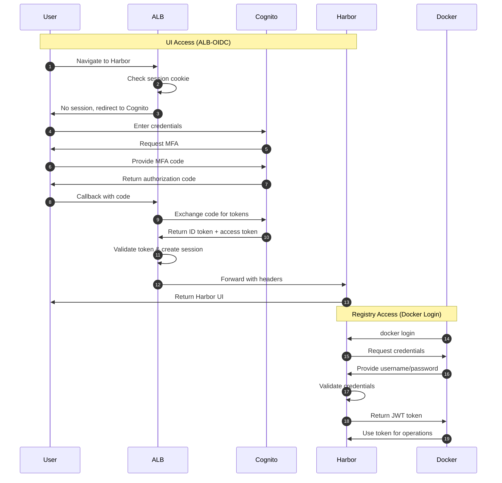
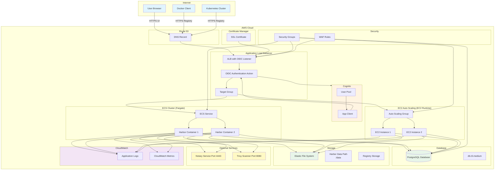

# Harbor Application Guide

Harbor is an open-source container registry that secures artifacts with policies and role-based access control, scans images for vulnerabilities, and signs images as trusted.

**Status**: Available (Not Yet Tested)

---

## Quick Reference

| Property | Value |
|----------|-------|
| **Application ID** | `harbor` |
| **Category** | Artifact Registry |
| **Default Image** | `goharbor/harbor-core:v2.9.0` |
| **Application Port** | `80` |
| **Default CPU** | 2048 (Fargate) |
| **Default Memory** | 4096 MB (Fargate) |
| **Default Instance** | t3.medium (EC2) |
| **Health Check Path** | `/` |
| **Health Check Grace** | 300 seconds |
| **Supports Fargate** | Yes |
| **Supports EC2** | Yes |
| **OIDC Support** | No (use ALB-OIDC) |
| **Database Required** | Yes (PostgreSQL) |

---

## Deployment Architecture

The following AWS architecture diagram shows the complete Harbor deployment:



## Authentication Flow

Harbor uses ALB-OIDC for UI access and Docker/OCI credentials for registry access:



## Architecture Diagram

The following diagram shows the Harbor deployment architecture:



---

## Capabilities

- Container image registry
- Image vulnerability scanning (Trivy)
- Content trust with image signing (Notary)
- Role-based access control
- Image replication across registries
- Garbage collection
- Audit logging
- Multi-tenancy with projects
- Helm chart repository
- OCI artifact support

---

## Optional Ports

| Port | Protocol | Direction | Feature Flag | Description |
|------|----------|-----------|--------------|-------------|
| 4443 | TCP | Inbound | `enableNotary` | Content Trust (Notary) |
| 8080 | TCP | Inbound | `enableTrivy` | Trivy Scanner |

**Example enabling security features:**
```json
{
  "enableNotary": true,
  "enableTrivy": true
}
```

---

## Database Requirements

| Property | Value |
|----------|-------|
| Engine | PostgreSQL 13+ |
| Instance Class | db.t3.medium (default) |
| Storage | 50 GB (default) |
| Database Name | `registry` |
| Backup Retention | 30 days |

**Database Parameters:**
- `max_connections`: 250
- `shared_buffers`: Optimized

---

## Authentication

### Supported Auth Modes

| Mode | Status | Description |
|------|--------|-------------|
| `alb-oidc` | Available | ALB-level authentication |
| `none` | Available | Local accounts only |

**Note:** Harbor has built-in OIDC support, but CloudForge integration is pending. Use ALB-OIDC for SSO.

---

## Environment Variables

| Variable | Description |
|----------|-------------|
| `HARBOR_HOSTNAME` | External hostname |
| `HARBOR_EXTERNAL_URL` | Full external URL |
| `POSTGRESQL_*` | Database connection |

---

## Storage Configuration

### Container (Fargate)
| Property | Value |
|----------|-------|
| Data Path | `/data` |
| EFS Path | `/harbor` |
| Volume Name | `harborData` |
| Container User | `10000:10000` |
| EFS Permissions | `755` |

### EC2
| Property | Value |
|----------|-------|
| EBS Device | `/dev/xvdh` |
| Data Path | `/data/harbor` |

---

## Deployment Context Examples

### Development

```json
{
  "stackName": "Harbor-Dev",
  "applicationId": "harbor",
  "applicationName": "Harbor Dev",
  "description": "Harbor development registry",
  "environment": "development",

  "runtime": "fargate",
  "securityProfile": "dev",
  "topology": "application-service",

  "networkMode": "private-with-nat",
  "region": "us-east-1",

  "authMode": "none",

  "cpu": 2048,
  "memory": 4096,

  "provisionDatabase": true,
  "databaseEngine": "postgres",
  "databaseVersion": "15",
  "databaseInstanceClass": "db.t3.small",
  "databaseAllocatedStorageGB": 50,
  "databaseName": "registry",

  "enableMonitoring": true,
  "logRetentionDays": "7"
}
```

### Production - With Security Scanning

```json
{
  "stackName": "Harbor-Production",
  "applicationId": "harbor",
  "applicationName": "Harbor Registry",
  "description": "Production container registry",
  "environment": "production",

  "runtime": "ec2",
  "securityProfile": "production",
  "topology": "application-service",

  "domain": "example.com",
  "subdomain": "registry",
  "enableSsl": true,

  "networkMode": "private-with-nat",
  "region": "us-east-1",

  "authMode": "alb-oidc",
  "cognitoAutoProvision": true,
  "cognitoDomainPrefix": "harbor-prod-yourcompany",
  "cognitoMfaEnabled": true,

  "instanceType": "t3.large",
  "minInstanceCapacity": 2,
  "maxInstanceCapacity": 4,

  "provisionDatabase": true,
  "databaseEngine": "postgres",
  "databaseVersion": "15",
  "databaseInstanceClass": "db.t3.medium",
  "databaseAllocatedStorageGB": 100,
  "databaseMultiAz": true,
  "databaseName": "registry",
  "databaseBackupRetentionDays": 30,

  "enableNotary": true,
  "enableTrivy": true,

  "complianceFrameworks": "SOC2",
  "awsConfigEnabled": true,
  "guardDutyEnabled": true,
  "wafEnabled": true,

  "enableMonitoring": true,
  "enableEncryption": true,
  "logRetentionDays": "730",
  "retainStorage": true
}
```

**Cost estimate:** ~$500/month

---

## Compliance Use Cases

- **SOC2**: Container image provenance and audit trails
- **PCI-DSS**: Secure storage of payment processing containers
- **HIPAA**: Vulnerability scanning for healthcare containers

---

## Post-Deployment Tasks

1. **Initial Login**: Navigate to Harbor URL, default: `admin` / `Harbor12345`
2. **Change Admin Password**: Immediately change default password
3. **Create Projects**: Organize images by team/application
4. **Configure Scanning**: Enable Trivy scanning policies
5. **Set Up Replication**: Configure replication to/from other registries

---

## Related Documentation

- [Harbor Documentation](https://goharbor.io/docs/)
- [Compliance Guide](../../compliance/README.md)
