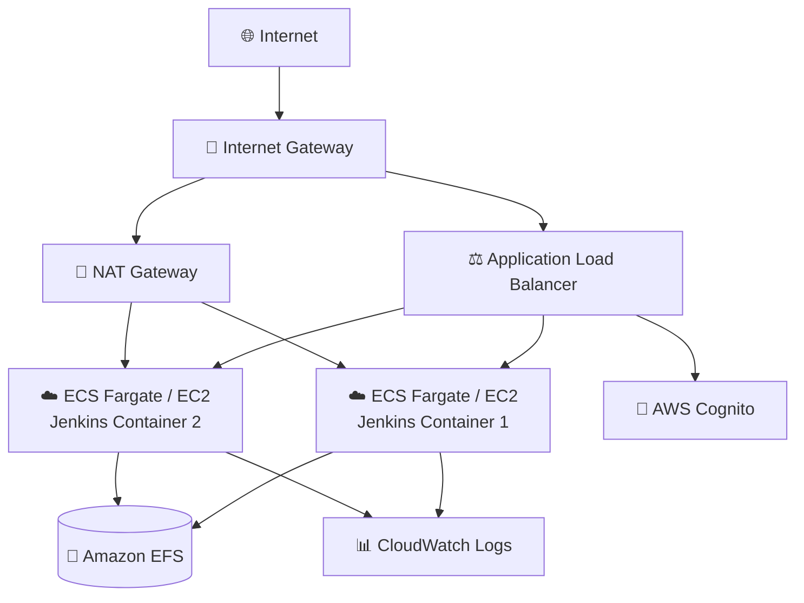
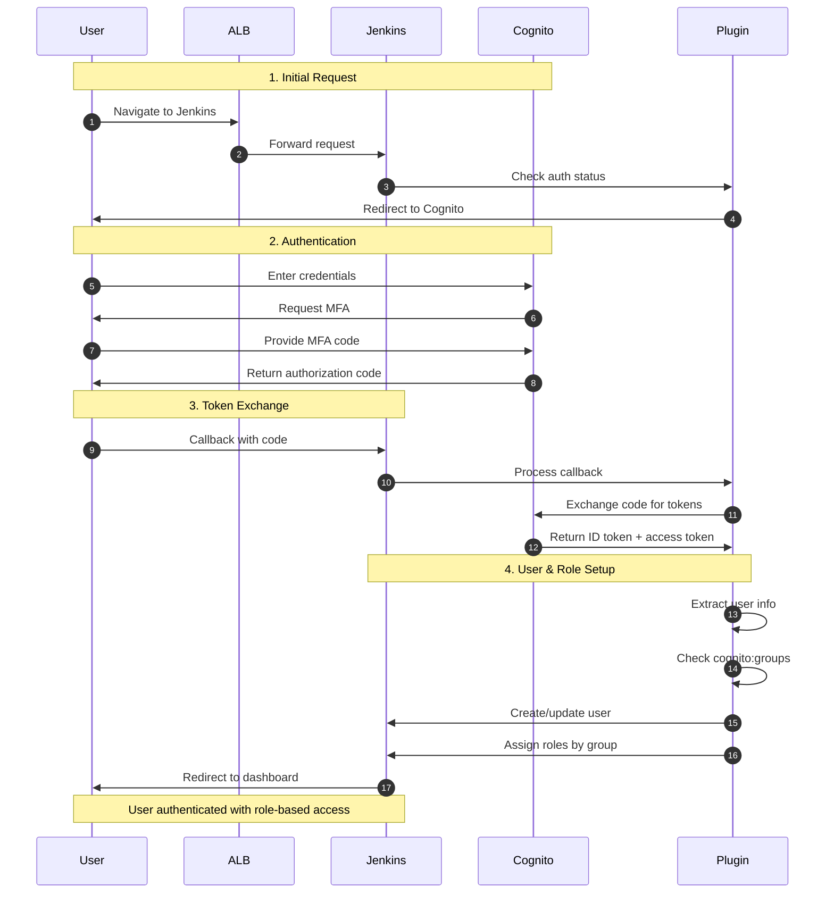
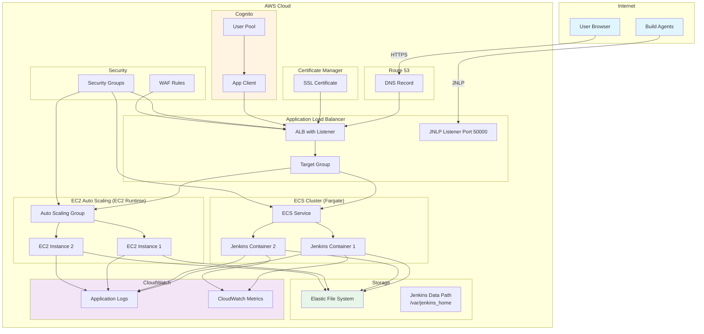

# Jenkins Application Guide

Jenkins is an open-source automation server that enables developers to build, test, and deploy applications through continuous integration and continuous delivery (CI/CD) pipelines.

**Status**: Verified

---

## Quick Reference

| Property | Value |
|----------|-------|
| **Application ID** | `jenkins` |
| **Category** | CI/CD |
| **Default Image** | `jenkins/jenkins:lts` |
| **Application Port** | `8080` |
| **Default CPU** | 1024 (Fargate) |
| **Default Memory** | 2048 MB (Fargate) |
| **Default Instance** | t3.small (EC2) |
| **Health Check Path** | `/login` |
| **Health Check Grace** | 300 seconds |
| **Supports Fargate** | Yes |
| **Supports EC2** | Yes |
| **OIDC Support** | Yes (Verified) |
| **Database Required** | No |

---

## Deployment Architecture

The following AWS architecture diagram shows the complete Jenkins deployment:



## Authentication Flow

When using `application-oidc` authentication mode, the following sequence diagram shows how users authenticate:



## Component Architecture

The following diagram shows the detailed component relationships:



---

## Capabilities

- Pipeline-as-code with Jenkinsfile
- Distributed builds with agents
- Extensive plugin ecosystem (1,800+ plugins)
- Configuration as Code (JCasC)
- Blue Ocean modern UI
- Role-based access control
- Integration with Git, Docker, Kubernetes

---

## Optional Ports

| Port | Protocol | Direction | Feature Flag | Description |
|------|----------|-----------|--------------|-------------|
| 50000 | TCP | Inbound | `enableAgents` | JNLP Build Agents |

**Example enabling agents:**
```json
{
  "enableAgents": true
}
```

When enabled, Jenkins agents can connect via JNLP protocol on port 50000.

---

## Authentication

### Supported Auth Modes

| Mode | Status | Description |
|------|--------|-------------|
| `application-oidc` | **Verified** | Native OIDC via OpenID Connect Authentication Plugin |
| `alb-oidc` | Verified | ALB-level authentication (works with any app) |
| `none` | Available | No authentication (development only) |

### OIDC Integration Details

Jenkins uses the **OpenID Connect Authentication Plugin** (oic-auth) configured via Jenkins Configuration as Code (JCasC).

**Features:**
- Auto-create users on first login
- Group/role mapping from OIDC claims (`cognito:groups`)
- Full user information synchronization
- Token-based session management
- Group-based authorization via project matrix
- Escape hatch disabled for security (OIDC-only)
- Logout integration with Cognito

**Callback Path:** `/securityRealm/finishLogin`

**Group-Based Authorization:**
- Admin group: Full permissions
- Developer group: Build, configure, create jobs
- Viewer group: Read-only access

---

## Environment Variables

CloudForge automatically configures these environment variables:

| Variable | Description | Example |
|----------|-------------|---------|
| `JAVA_OPTS` | JVM options for reverse proxy | `-Djenkins.install.runSetupWizard=false` |
| `JENKINS_OPTS` | Jenkins-specific options | `--httpListenAddress=0.0.0.0` |
| `JENKINS_URL` | External URL (if FQDN provided) | `https://jenkins.example.com` |

**JAVA_OPTS includes:**
- X-Forwarded headers configuration for ALB
- CSRF settings for reverse proxy
- Root URL configuration
- Setup wizard skip (when using OIDC)

---

## Storage Configuration

### Container (Fargate)
| Property | Value |
|----------|-------|
| Data Path | `/var/jenkins_home` |
| EFS Path | `/jenkins` |
| Volume Name | `jenkinsHome` |
| Container User | `1000:1000` |
| EFS Permissions | `750` |

### EC2
| Property | Value |
|----------|-------|
| EBS Device | `/dev/xvdh` |
| Data Path | `/var/lib/jenkins` |
| Log Paths | `/var/log/jenkins/jenkins.log`, `/var/log/userdata.log`, `/var/log/messages` |

---

## Deployment Context Examples

### Development - Minimal Setup

Fastest way to get Jenkins running for local development or testing.

```json
{
  "stackName": "Jenkins-Dev",
  "applicationId": "jenkins",
  "applicationName": "Jenkins Dev",
  "description": "Jenkins development environment",
  "environment": "development",

  "runtime": "fargate",
  "securityProfile": "dev",
  "topology": "application-service",

  "networkMode": "public-no-nat",
  "region": "us-east-1",

  "authMode": "none",

  "cpu": 1024,
  "memory": 2048,

  "enableMonitoring": true,
  "logRetentionDays": "7"
}
```

**Cost estimate:** ~$35/month

### Development - With Authentication

Jenkins with Cognito OIDC for team development.

```json
{
  "stackName": "Jenkins-Dev-Auth",
  "applicationId": "jenkins",
  "applicationName": "Jenkins Dev",
  "description": "Jenkins with Cognito authentication",
  "environment": "development",

  "runtime": "fargate",
  "securityProfile": "dev",
  "topology": "application-service",

  "domain": "dev.example.com",
  "subdomain": "jenkins",
  "enableSsl": true,

  "networkMode": "private-with-nat",
  "region": "us-east-1",

  "authMode": "application-oidc",
  "cognitoAutoProvision": true,
  "cognitoDomainPrefix": "jenkins-dev-yourcompany",
  "cognitoCreateGroups": true,
  "cognitoAdminGroupName": "JenkinsAdmins",
  "cognitoUserGroupName": "JenkinsDevelopers",

  "cpu": 1024,
  "memory": 2048,

  "enableMonitoring": true,
  "logRetentionDays": "30"
}
```

**Cost estimate:** ~$100/month

### Staging - SOC2 Compliance

Pre-production environment with compliance controls.

```json
{
  "stackName": "Jenkins-Staging",
  "applicationId": "jenkins",
  "applicationName": "Jenkins Staging",
  "description": "Jenkins staging with SOC2 compliance",
  "environment": "staging",

  "runtime": "fargate",
  "securityProfile": "staging",
  "topology": "application-service",

  "domain": "staging.example.com",
  "subdomain": "jenkins",
  "enableSsl": true,

  "networkMode": "private-with-nat",
  "region": "us-east-1",

  "authMode": "application-oidc",
  "cognitoAutoProvision": true,
  "cognitoDomainPrefix": "jenkins-staging-yourcompany",
  "cognitoMfaEnabled": true,
  "cognitoMfaMethod": "totp",
  "cognitoCreateGroups": true,
  "cognitoAdminGroupName": "JenkinsAdmins",
  "cognitoUserGroupName": "JenkinsDevelopers",

  "cpu": 2048,
  "memory": 4096,
  "minInstanceCapacity": 1,
  "maxInstanceCapacity": 2,
  "enableAutoScaling": true,

  "complianceFrameworks": "SOC2",
  "scopeConfigRulesToDeployment": true,
  "awsConfigEnabled": true,
  "guardDutyEnabled": true,
  "wafEnabled": true,
  "enableFlowlogs": true,

  "enableMonitoring": true,
  "enableEncryption": true,
  "logRetentionDays": "365"
}
```

**Cost estimate:** ~$220/month

### Production - SOC2 with Build Agents

Full production deployment with agent support and high availability.

```json
{
  "stackName": "Jenkins-Production",
  "applicationId": "jenkins",
  "applicationName": "Jenkins CI",
  "description": "Production Jenkins with SOC2 compliance and build agents",
  "environment": "production",

  "runtime": "ec2",
  "securityProfile": "production",
  "topology": "application-service",

  "domain": "example.com",
  "subdomain": "jenkins",
  "enableSsl": true,

  "networkMode": "private-with-nat",
  "region": "us-east-1",

  "authMode": "application-oidc",
  "cognitoAutoProvision": true,
  "cognitoDomainPrefix": "jenkins-prod-yourcompany",
  "cognitoMfaEnabled": true,
  "cognitoMfaMethod": "totp",
  "cognitoCreateGroups": true,
  "cognitoAdminGroupName": "JenkinsAdmins",
  "cognitoUserGroupName": "JenkinsDevelopers",

  "instanceType": "t3.medium",
  "minInstanceCapacity": 2,
  "maxInstanceCapacity": 4,
  "enableAutoScaling": true,
  "cpuTargetUtilization": 60,

  "enableAgents": true,

  "complianceFrameworks": "SOC2",
  "scopeConfigRulesToDeployment": false,
  "awsConfigEnabled": true,
  "createConfigInfrastructure": true,
  "guardDutyEnabled": true,
  "auditManagerEnabled": true,
  "wafEnabled": true,
  "albAccessLogging": true,
  "enableFlowlogs": true,

  "enableMonitoring": true,
  "enableEncryption": true,
  "logRetentionDays": "730",
  "retainStorage": true
}
```

**Cost estimate:** ~$400-600/month

### Production - PCI-DSS (Payment Systems)

For CI/CD pipelines deploying payment processing applications.

```json
{
  "stackName": "Jenkins-PCI",
  "applicationId": "jenkins",
  "applicationName": "Jenkins PCI",
  "description": "Jenkins for PCI-DSS compliant deployments",
  "environment": "production",

  "runtime": "ec2",
  "securityProfile": "production",
  "topology": "application-service",

  "domain": "secure.example.com",
  "subdomain": "jenkins",
  "enableSsl": true,

  "networkMode": "private-with-nat",
  "region": "us-east-1",

  "authMode": "application-oidc",
  "cognitoAutoProvision": true,
  "cognitoDomainPrefix": "jenkins-pci-yourcompany",
  "cognitoMfaEnabled": true,
  "cognitoMfaMethod": "totp",
  "cognitoCreateGroups": true,
  "cognitoAdminGroupName": "JenkinsAdmins",
  "cognitoUserGroupName": "JenkinsDevelopers",

  "instanceType": "t3.large",
  "minInstanceCapacity": 2,
  "maxInstanceCapacity": 6,
  "enableAutoScaling": true,
  "cpuTargetUtilization": 50,

  "enableAgents": true,

  "complianceFrameworks": "PCI-DSS,SOC2",
  "scopeConfigRulesToDeployment": false,
  "awsConfigEnabled": true,
  "createConfigInfrastructure": true,
  "guardDutyEnabled": true,
  "auditManagerEnabled": true,
  "wafEnabled": true,
  "albAccessLogging": true,
  "enableFlowlogs": true,

  "enableMonitoring": true,
  "enableEncryption": true,
  "logRetentionDays": "730",
  "retainStorage": true
}
```

**Cost estimate:** ~$600-900/month

---

## Health Check Configuration

| Property | Default | Description |
|----------|---------|-------------|
| Path | `/login` | Health check endpoint |
| Grace Period | 300 seconds | Time before health checks start |
| Interval | 30 seconds | Time between checks |
| Timeout | 5 seconds | Response timeout |
| Healthy Threshold | 2 | Consecutive successes |
| Unhealthy Threshold | 3 | Consecutive failures |

**Custom configuration:**
```json
{
  "healthCheckGracePeriod": 300,
  "healthCheckInterval": 30,
  "healthCheckTimeout": 5,
  "healthyThreshold": 2,
  "unhealthyThreshold": 3
}
```

---

## Compliance Considerations

### SOC2

**Automatic Controls:**
- Encryption at rest (EBS/EFS)
- Encryption in transit (TLS)
- Network isolation (Security Groups)
- CloudWatch logging
- IAM least privilege

**User Responsibilities:**
- [ ] Enable audit logging for all builds
- [ ] Implement approval gates for production
- [ ] Use secrets management (Credentials Plugin)
- [ ] Configure artifact retention (30-90 days)
- [ ] Enable OIDC authentication
- [ ] Implement role-based access control
- [ ] Separate dev/test/prod pipelines

### PCI-DSS

Additional requirements when deploying to payment systems:
- [ ] Separate development/test/production pipelines
- [ ] Code review before production deployment
- [ ] Automated security testing in pipeline
- [ ] Change approval workflow
- [ ] Audit trail for all deployments

### HIPAA

Additional requirements when deploying healthcare applications:
- [ ] Audit trail for all deployments
- [ ] Access controls for PHI-related pipelines
- [ ] Encryption of build artifacts

---

## Post-Deployment Tasks

### 1. Initial Login

After deployment with `authMode: "application-oidc"`:

1. Navigate to `https://jenkins.your-domain.com`
2. Click "Sign in with OpenID Connect"
3. Authenticate with Cognito
4. First user in admin group gets full permissions

### 2. Configure Build Agents (if enabled)

When `enableAgents: true`:

1. Go to **Manage Jenkins** > **Manage Nodes**
2. Create new agent with JNLP connection
3. Use agent secret from Jenkins
4. Connect via port 50000

### 3. Install Additional Plugins

Recommended plugins for production:
- Blue Ocean (modern UI)
- Pipeline (if not installed)
- Git plugin
- Credentials Binding
- Role-based Authorization Strategy

### 4. Configure Secrets

1. Go to **Manage Jenkins** > **Credentials**
2. Add credentials for:
   - Source control (GitHub, GitLab tokens)
   - Container registries
   - Cloud providers (AWS credentials)
   - Deployment targets

---

## Troubleshooting

### Jenkins won't start

**Check logs:**
```bash
# Fargate
aws logs tail /aws/ecs/jenkins --follow

# EC2
ssh ec2-user@instance 'tail -f /var/log/jenkins/jenkins.log'
```

### OIDC login fails

1. Verify Cognito domain prefix is globally unique
2. Check callback URL is registered in Cognito
3. Verify app client has correct OAuth settings

### Build agents can't connect

1. Ensure `enableAgents: true` in deployment context
2. Check security group allows port 50000
3. Verify agent is using correct secret

---

## Related Documentation

- [OIDC Integration](../../applications/OIDC.md)
- [Compliance Guide](../../compliance/README.md)
- [Deployment Context Reference](../../examples/README.md)
