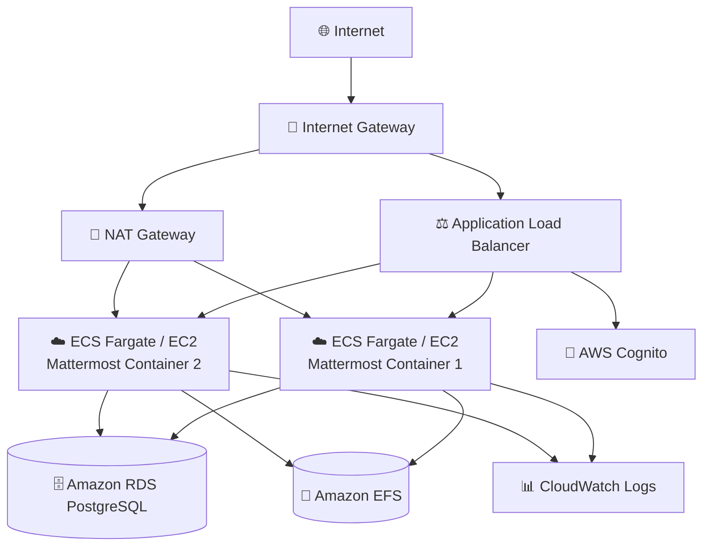
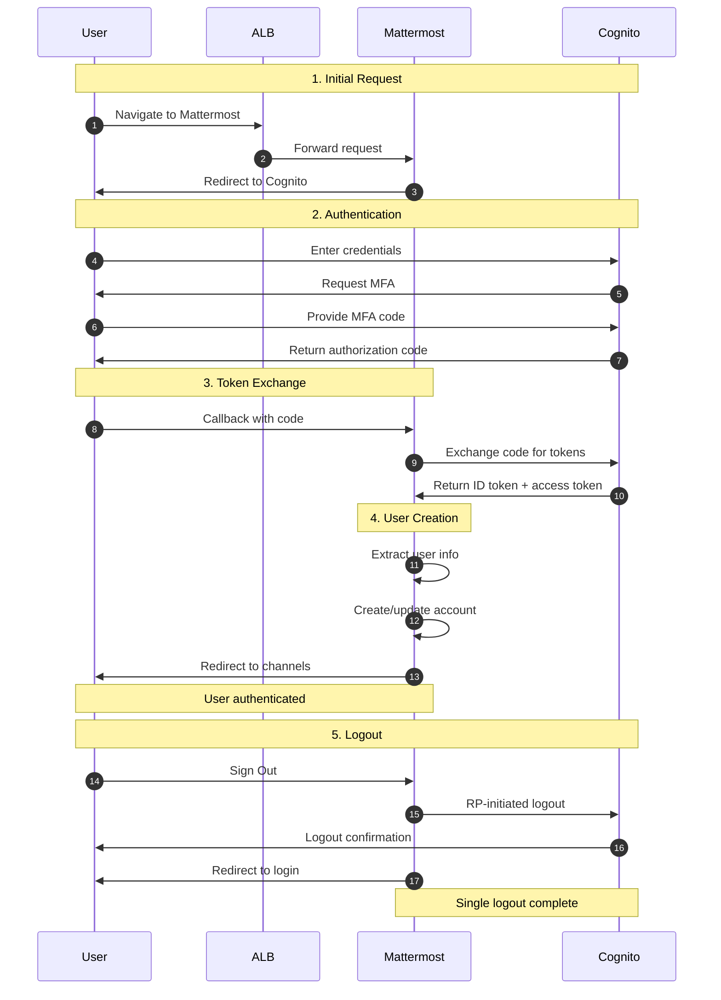
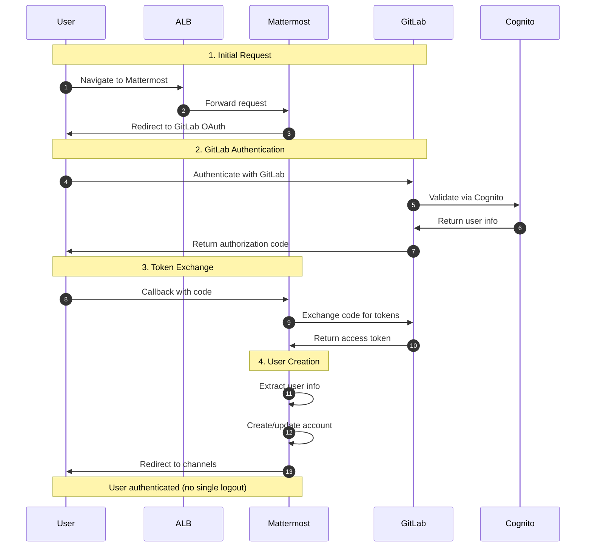
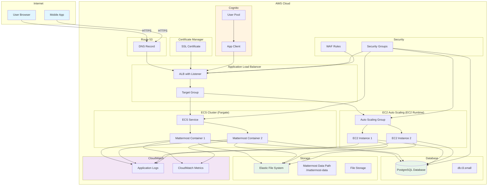

# Mattermost Application Guide

Mattermost is an open-source, self-hosted team collaboration platform providing secure messaging, file sharing, and integrations for enterprise teams.

**Status**: Verified

---

## Editions Overview

CloudForge supports two Mattermost editions:

| Edition | Application ID | License | OIDC Method | Single Logout |
|---------|---------------|---------|-------------|---------------|
| **Team (Free)** | `mattermost-team` | None required | GitLab OAuth | ❌ No |
| **Enterprise** | `mattermost-enterprise` | Required for enterprise features | Native OpenID Connect | ✅ Yes |

### Which Edition Should I Use?

**Use `mattermost-team` (Free) if:**
- You want a free, open-source solution
- Single logout is not a requirement
- You don't need AD/LDAP group sync or compliance exports

**Use `mattermost-enterprise` if:**
- You need single logout (logging out of Mattermost also logs out of Cognito)
- You require SAML 2.0 support
- You need AD/LDAP group synchronization
- You need compliance exports or high availability clustering
- You have or plan to purchase a Mattermost license

> **Note:** Both editions use the same Enterprise Edition Docker image. The Team edition simply runs without a license, using GitLab OAuth for OIDC compatibility. Enterprise features are unlocked by uploading a license.

---

## Quick Reference

### Mattermost Team (Free)

| Property | Value |
|----------|-------|
| **Application ID** | `mattermost-team` |
| **Category** | Collaboration |
| **Default Image** | `mattermost/mattermost-enterprise-edition:latest` |
| **Application Port** | `8065` |
| **Default CPU** | 1024 (Fargate) |
| **Default Memory** | 2048 MB (Fargate) |
| **Default Instance** | t3.small (EC2) |
| **Health Check Path** | `/` |
| **Health Check Grace** | 300 seconds |
| **Supports Fargate** | Yes |
| **Supports EC2** | Yes |
| **OIDC Support** | Yes (GitLab OAuth) |
| **Database Required** | Yes (PostgreSQL) |

### Mattermost Enterprise

| Property | Value |
|----------|-------|
| **Application ID** | `mattermost-enterprise` |
| **Category** | Collaboration |
| **Default Image** | `mattermost/mattermost-enterprise-edition:latest` |
| **Application Port** | `8065` |
| **Default CPU** | 1024 (Fargate) |
| **Default Memory** | 2048 MB (Fargate) |
| **Default Instance** | t3.small (EC2) |
| **Health Check Path** | `/` |
| **Health Check Grace** | 300 seconds |
| **Supports Fargate** | Yes |
| **Supports EC2** | Yes |
| **OIDC Support** | Yes (Native OpenID Connect) |
| **Database Required** | Yes (PostgreSQL) |

---

## Deployment Architecture

The following AWS architecture diagram shows the complete Mattermost deployment:



## Authentication Flow

When using `application-oidc` authentication mode, the authentication flow differs by edition:

### Enterprise Edition (Native OIDC)



### Team Edition (GitLab OAuth)



## Architecture Diagram

The following diagram shows the Mattermost deployment architecture:



---

## Capabilities

- Real-time team messaging
- Direct messages and group channels
- File sharing with preview
- Audio/video calls (with plugins)
- Webhooks and bot integrations
- Mobile apps (iOS, Android)
- Desktop apps (Windows, Mac, Linux)
- LDAP/AD integration
- Custom emojis and branding
- Message search and archiving
- Compliance exports

**Note:** The Enterprise Edition image runs in "Team Edition" mode without a license, providing core features. Enterprise features require a license.

---

## Optional Ports

### Mattermost Team (Free)

| Port | Protocol | Direction | Feature Flag | Description |
|------|----------|-----------|--------------|-------------|
| 587 | TCP | Outbound | `enableSmtp` | SMTP Email (STARTTLS) |
| 465 | TCP | Outbound | `enableSmtps` | SMTP Email (TLS) |

> **Note:** Clustering is not available in Team Edition.

### Mattermost Enterprise

| Port | Protocol | Direction | Feature Flag | Description |
|------|----------|-----------|--------------|-------------|
| 587 | TCP | Outbound | `enableSmtp` | SMTP Email (STARTTLS) |
| 465 | TCP | Outbound | `enableSmtps` | SMTP Email (TLS) |
| 8074 | TCP | Inbound | `enableClustering` | Cluster Gossip |
| 8075 | TCP | Inbound | `enableClustering` | Cluster Gossip |

**Example enabling SMTP:**
```json
{
  "enableSmtp": true
}
```

**Example enabling clustering (High Availability):**
```json
{
  "enableClustering": true
}
```

---

## Database Requirements

Mattermost **requires** a PostgreSQL database.

| Property | Value |
|----------|-------|
| Engine | PostgreSQL 14+ |
| Instance Class | db.t3.small (default) |
| Storage | 30 GB (default) |
| Database Name | `mattermost` |
| Backup Retention | 14 days |

**Database Parameters:**
- `max_connections`: 200
- `shared_buffers`: Optimized for instance class
- `work_mem`: 16MB

When deploying Mattermost, CloudForge automatically provisions RDS PostgreSQL.

---

## Authentication

### Supported Auth Modes

| Mode | Team Edition | Enterprise Edition | Description |
|------|--------------|-------------------|-------------|
| `application-oidc` | ⚠️ Partial (no logout) | ⚠️ Partial (logout issue) | Application handles OIDC directly |
| `alb-oidc` | ✅ Verified | ✅ Verified | ALB-level authentication (Recommended) |
| `none` | ✅ | ✅ | No SSO (local accounts only) |

### OIDC Integration Details

#### Mattermost Team (Free) - GitLab OAuth

Team Edition uses the **GitLab OAuth provider** (`MM_GITLABSETTINGS_*`) for OIDC compatibility. This works with any OAuth 2.0 / OpenID Connect provider including Cognito.

**Features:**
- Auto-create users on first login
- Email-based account creation
- Customizable login button text and color
- OAuth 2.0 / OpenID Connect standard flow

**Callback Path:** `/signup/gitlab/complete`

**Limitations:**
- ⚠️ **No single logout** - Logging out of Mattermost does NOT log out of Cognito
- No automatic group synchronization (manual team membership)
- No AD/LDAP sync in OIDC mode
- Manual endpoint configuration (no discovery endpoint)

#### Mattermost Enterprise - Native OpenID Connect

Enterprise Edition uses **native OpenID Connect** (`MM_OPENIDSETTINGS_*`) with full OIDC 1.0 support.

**Features:**
- Auto-create users on first login
- Discovery endpoint for automatic configuration
- Customizable login button text and color
- Standard OpenID Connect 1.0 compliance

**Callback Path:** `/signup/openid/complete`

**⚠️ KNOWN ISSUE: Logout callback URL issue:**
- **Root Cause:** Logout flow fails to return to correct callback URL after logging out of OIDC provider
- **Symptoms:** User successfully logs out of Mattermost but redirect after provider logout fails
- **Status:** Login works correctly; logout issue under investigation
- **Workaround:** Use `alb-oidc` mode for full logout support, or accept manual browser navigation after logout

**Limitations:**
- Requires Mattermost Enterprise or Professional license for full features
- No automatic group synchronization (manual team membership)
- Single logout flow has known callback redirect issue (see above)

**Note:** SAML support exists but OIDC is the verified and recommended approach.

---

## Environment Variables

CloudForge automatically configures these environment variables:

| Variable | Description | Example |
|----------|-------------|---------|
| `MM_SERVICESETTINGS_SITEURL` | External URL (critical for OAuth) | `https://chat.example.com` |
| `MM_SERVICESETTINGS_TRUSTEDPROXYIPHEADER` | Trust ALB headers | `X-Forwarded-For,X-Real-IP` |
| `MM_SERVICESETTINGS_FORWARD80TO443` | Disable (ALB handles) | `false` |
| `MM_SQLSETTINGS_DRIVERNAME` | Database driver | `postgres` |
| `MM_SQLSETTINGS_DATASOURCE` | Database connection | Injected via SSM |

### OIDC Variables - Team Edition (GitLab OAuth)

| Variable | Description |
|----------|-------------|
| `MM_GITLABSETTINGS_ENABLE` | Enable GitLab OAuth |
| `MM_GITLABSETTINGS_ID` | OAuth client ID |
| `MM_GITLABSETTINGS_SECRET` | OAuth client secret (via ECS secrets) |
| `MM_GITLABSETTINGS_AUTHENDPOINT` | Authorization endpoint |
| `MM_GITLABSETTINGS_TOKENENDPOINT` | Token endpoint |
| `MM_GITLABSETTINGS_USERAPIENDPOINT` | UserInfo endpoint |
| `MM_GITLABSETTINGS_SCOPE` | OAuth scopes (`openid profile email`) |
| `MM_GITLABSETTINGS_BUTTONTEXT` | Login button text |
| `MM_GITLABSETTINGS_BUTTONCOLOR` | Login button color |

### OIDC Variables - Enterprise Edition (Native OIDC)

| Variable | Description |
|----------|-------------|
| `MM_OPENIDSETTINGS_ENABLE` | Enable native OpenID Connect |
| `MM_OPENIDSETTINGS_ID` | OIDC client ID |
| `MM_OPENIDSETTINGS_SECRET` | OIDC client secret (via ECS secrets) |
| `MM_OPENIDSETTINGS_DISCOVERYENDPOINT` | OIDC discovery endpoint |
| `MM_OPENIDSETTINGS_SCOPE` | OIDC scopes (`openid profile email`) |
| `MM_OPENIDSETTINGS_BUTTONTEXT` | Login button text |
| `MM_OPENIDSETTINGS_BUTTONCOLOR` | Login button color |

---

## Storage Configuration

### Container (Fargate)
| Property | Value |
|----------|-------|
| Data Path | `/mattermost/data` |
| EFS Path | `/mattermost` |
| Volume Name | `mattermostData` |
| Container User | `2000:2000` |
| EFS Permissions | `755` |

### EC2
| Property | Value |
|----------|-------|
| EBS Device | `/dev/xvdh` |
| Data Path | `/opt/mattermost/data` |
| Log Paths | `/opt/mattermost/logs/mattermost.log`, `/var/log/userdata.log` |

---

## Deployment Context Examples

### Development - Minimal Setup (Team Edition)

Quick Mattermost for testing (uses embedded database - not for production).

```json
{
  "stackName": "Mattermost-Dev",
  "applicationId": "mattermost-team",
  "applicationName": "Mattermost Dev",
  "description": "Mattermost development environment",
  "environment": "development",

  "runtime": "fargate",
  "securityProfile": "dev",
  "topology": "application-service",

  "networkMode": "public-no-nat",
  "region": "us-east-1",

  "authMode": "none",

  "cpu": 1024,
  "memory": 2048,

  "enableMonitoring": true,
  "logRetentionDays": "7"
}
```

**Note:** Without RDS, Mattermost uses H2 embedded database (single instance only).

**Cost estimate:** ~$40/month

### Development - With Database (Team Edition)

Team development with PostgreSQL database.

```json
{
  "stackName": "Mattermost-Dev-DB",
  "applicationId": "mattermost-team",
  "applicationName": "Mattermost Dev",
  "description": "Mattermost with PostgreSQL",
  "environment": "development",

  "runtime": "fargate",
  "securityProfile": "dev",
  "topology": "application-service",

  "domain": "dev.example.com",
  "subdomain": "chat",
  "enableSsl": true,

  "networkMode": "private-with-nat",
  "region": "us-east-1",

  "authMode": "application-oidc",
  "cognitoAutoProvision": true,
  "cognitoDomainPrefix": "mattermost-dev-yourcompany",
  "cognitoCreateGroups": true,

  "cpu": 1024,
  "memory": 2048,

  "provisionDatabase": true,
  "databaseEngine": "postgres",
  "databaseVersion": "15",
  "databaseInstanceClass": "db.t3.micro",
  "databaseAllocatedStorageGB": 20,
  "databaseName": "mattermost",

  "enableMonitoring": true,
  "logRetentionDays": "30"
}
```

**Cost estimate:** ~$80/month

### Staging - With Email (Enterprise Edition)

Pre-production with SMTP for email notifications and single logout.

```json
{
  "stackName": "Mattermost-Staging",
  "applicationId": "mattermost-enterprise",
  "applicationName": "Mattermost Staging",
  "description": "Mattermost staging with email",
  "environment": "staging",

  "runtime": "fargate",
  "securityProfile": "staging",
  "topology": "application-service",

  "domain": "staging.example.com",
  "subdomain": "chat",
  "enableSsl": true,

  "networkMode": "private-with-nat",
  "region": "us-east-1",

  "authMode": "application-oidc",
  "cognitoAutoProvision": true,
  "cognitoDomainPrefix": "mattermost-staging-yourcompany",
  "cognitoMfaEnabled": true,
  "cognitoMfaMethod": "totp",
  "cognitoCreateGroups": true,

  "cpu": 1024,
  "memory": 2048,
  "minInstanceCapacity": 1,
  "maxInstanceCapacity": 2,

  "provisionDatabase": true,
  "databaseEngine": "postgres",
  "databaseVersion": "15",
  "databaseInstanceClass": "db.t3.small",
  "databaseAllocatedStorageGB": 30,
  "databaseName": "mattermost",
  "databaseBackupRetentionDays": 7,

  "enableSmtp": true,

  "complianceFrameworks": "SOC2",
  "scopeConfigRulesToDeployment": true,
  "awsConfigEnabled": true,
  "wafEnabled": true,

  "enableMonitoring": true,
  "enableEncryption": true,
  "logRetentionDays": "365"
}
```

**Cost estimate:** ~$180/month

### Production - SOC2 Compliance (Enterprise Edition)

Full production deployment for enterprise teams with native OIDC and single logout.

```json
{
  "stackName": "Mattermost-Production",
  "applicationId": "mattermost-enterprise",
  "applicationName": "Mattermost",
  "description": "Production Mattermost with SOC2 compliance",
  "environment": "production",

  "runtime": "ec2",
  "securityProfile": "production",
  "topology": "application-service",

  "domain": "example.com",
  "subdomain": "chat",
  "enableSsl": true,

  "networkMode": "private-with-nat",
  "region": "us-east-1",

  "authMode": "application-oidc",
  "cognitoAutoProvision": true,
  "cognitoDomainPrefix": "mattermost-prod-yourcompany",
  "cognitoMfaEnabled": true,
  "cognitoMfaMethod": "totp",
  "cognitoCreateGroups": true,
  "cognitoAdminGroupName": "MattermostAdmins",
  "cognitoUserGroupName": "MattermostUsers",

  "instanceType": "t3.medium",
  "minInstanceCapacity": 2,
  "maxInstanceCapacity": 4,
  "enableAutoScaling": true,
  "cpuTargetUtilization": 60,

  "provisionDatabase": true,
  "databaseEngine": "postgres",
  "databaseVersion": "15",
  "databaseInstanceClass": "db.t3.medium",
  "databaseAllocatedStorageGB": 50,
  "databaseMultiAz": true,
  "databaseName": "mattermost",
  "databaseBackupRetentionDays": 30,

  "enableSmtp": true,

  "complianceFrameworks": "SOC2",
  "scopeConfigRulesToDeployment": false,
  "awsConfigEnabled": true,
  "createConfigInfrastructure": true,
  "guardDutyEnabled": true,
  "auditManagerEnabled": true,
  "wafEnabled": true,
  "albAccessLogging": true,
  "enableFlowlogs": true,

  "enableMonitoring": true,
  "enableEncryption": true,
  "logRetentionDays": "730",
  "retainStorage": true
}
```

**Cost estimate:** ~$450/month

### Production - HIPAA (Healthcare) (Enterprise Edition)

For healthcare teams communicating about PHI.

```json
{
  "stackName": "Mattermost-HIPAA",
  "applicationId": "mattermost-enterprise",
  "applicationName": "Mattermost Secure",
  "description": "HIPAA-compliant team messaging",
  "environment": "production",

  "runtime": "ec2",
  "securityProfile": "production",
  "topology": "application-service",

  "domain": "secure.healthcare.com",
  "subdomain": "chat",
  "enableSsl": true,

  "networkMode": "private-with-nat",
  "region": "us-east-1",

  "authMode": "application-oidc",
  "cognitoAutoProvision": true,
  "cognitoDomainPrefix": "mattermost-hipaa-yourcompany",
  "cognitoMfaEnabled": true,
  "cognitoMfaMethod": "totp",
  "cognitoCreateGroups": true,

  "instanceType": "t3.medium",
  "minInstanceCapacity": 2,
  "maxInstanceCapacity": 6,
  "enableAutoScaling": true,

  "provisionDatabase": true,
  "databaseEngine": "postgres",
  "databaseVersion": "15",
  "databaseInstanceClass": "db.t3.medium",
  "databaseAllocatedStorageGB": 100,
  "databaseMultiAz": true,
  "databaseName": "mattermost",
  "databaseBackupRetentionDays": 90,

  "enableSmtp": true,

  "complianceFrameworks": "HIPAA,SOC2",
  "scopeConfigRulesToDeployment": false,
  "awsConfigEnabled": true,
  "createConfigInfrastructure": true,
  "guardDutyEnabled": true,
  "auditManagerEnabled": true,
  "wafEnabled": true,
  "albAccessLogging": true,
  "enableFlowlogs": true,

  "enableMonitoring": true,
  "enableEncryption": true,
  "logRetentionDays": "2190",
  "retainStorage": true
}
```

**Cost estimate:** ~$550/month

### High Availability - Clustering (Enterprise Edition)

For large organizations requiring high availability. Requires Enterprise license.

```json
{
  "stackName": "Mattermost-HA",
  "applicationId": "mattermost-enterprise",
  "applicationName": "Mattermost HA",
  "description": "High availability Mattermost cluster",
  "environment": "production",

  "runtime": "ec2",
  "securityProfile": "production",
  "topology": "application-service",

  "domain": "enterprise.example.com",
  "subdomain": "chat",
  "enableSsl": true,

  "networkMode": "private-with-nat",
  "region": "us-east-1",

  "authMode": "application-oidc",
  "cognitoAutoProvision": true,
  "cognitoDomainPrefix": "mattermost-ha-yourcompany",
  "cognitoMfaEnabled": true,
  "cognitoMfaMethod": "totp",

  "instanceType": "t3.large",
  "minInstanceCapacity": 3,
  "maxInstanceCapacity": 10,
  "enableAutoScaling": true,
  "cpuTargetUtilization": 50,

  "provisionDatabase": true,
  "databaseEngine": "aurora-postgresql",
  "databaseVersion": "15",
  "databaseInstanceClass": "db.r5.large",
  "databaseAllocatedStorageGB": 100,
  "databaseMultiAz": true,
  "databaseName": "mattermost",
  "databaseBackupRetentionDays": 30,

  "enableSmtp": true,
  "enableClustering": true,

  "complianceFrameworks": "SOC2",
  "scopeConfigRulesToDeployment": false,
  "awsConfigEnabled": true,
  "guardDutyEnabled": true,
  "wafEnabled": true,
  "albAccessLogging": true,

  "enableMonitoring": true,
  "enableEncryption": true,
  "logRetentionDays": "730",
  "retainStorage": true
}
```

**Cost estimate:** ~$800+/month

---

## Health Check Configuration

| Property | Default | Description |
|----------|---------|-------------|
| Path | `/` | Health check endpoint |
| Grace Period | 300 seconds | Time before health checks start |
| Interval | 30 seconds | Time between checks |
| Timeout | 5 seconds | Response timeout |
| Healthy Threshold | 2 | Consecutive successes |
| Unhealthy Threshold | 3 | Consecutive failures |

---

## Compliance Considerations

### SOC2

**Automatic Controls:**
- Encryption at rest (EBS/EFS/RDS)
- Encryption in transit (TLS)
- Network isolation (Security Groups)
- CloudWatch logging
- Database backup retention

**Use Cases:**
- Audit logs for team communications
- Access control via OIDC

**User Responsibilities:**
- [ ] Configure message retention policies
- [ ] Enable compliance exports (Enterprise)
- [ ] Set up audit logging
- [ ] Configure data retention

### HIPAA

**Automatic Controls:**
- All SOC2 controls
- 6-year log retention
- Enhanced encryption

**User Responsibilities:**
- [ ] Enable compliance exports
- [ ] Configure DLP policies (Enterprise)
- [ ] Disable public channels for PHI
- [ ] Train users on PHI handling

### GDPR

**User Responsibilities:**
- [ ] Configure data retention policies
- [ ] Enable user data export
- [ ] Implement right to erasure procedures
- [ ] Privacy policy in instance

---

## Post-Deployment Tasks

### 1. Initial Login

After deployment with `authMode: "application-oidc"`:

1. Navigate to `https://chat.your-domain.com`
2. Click "Sign in with AWS Cognito"
   - **Team Edition**: Uses GitLab OAuth provider (callback: `/signup/gitlab/complete`)
   - **Enterprise Edition**: Uses native OIDC (callback: `/signup/openid/complete`)
3. Authenticate with Cognito
4. First user becomes system admin

> **Note (Team Edition):** When logging out of Mattermost, you will NOT be logged out of Cognito. Your Cognito session remains active until it expires. For proper single logout, use Enterprise Edition.

### 2. Create Teams and Channels

1. Go to **System Console** > **Teams**
2. Create initial teams
3. Create public and private channels
4. Invite users

### 3. Configure Email (if enabled)

When `enableSmtp: true`, configure in System Console:

1. **System Console** > **Email** > **SMTP**
2. Enter SMTP server details (e.g., Amazon SES)
3. Test email delivery

### 4. Configure Integrations

1. Enable incoming/outgoing webhooks
2. Install plugins (Jira, GitHub, etc.)
3. Configure slash commands

---

## Troubleshooting

### Mattermost won't start

**Check logs:**
```bash
# Fargate
aws logs tail /aws/ecs/mattermost --follow

# EC2
ssh ec2-user@instance 'tail -f /opt/mattermost/logs/mattermost.log'
```

### Database connection fails

1. Verify security group allows port 5432
2. Check RDS endpoint in SSM parameters
3. Verify database credentials in Secrets Manager

### OIDC login fails

1. Verify Cognito domain prefix is globally unique
2. Check callback URL is registered
3. Ensure `MM_SERVICESETTINGS_SITEURL` matches actual URL

### WebSocket errors

1. Check ALB is configured for sticky sessions
2. Verify security groups allow WebSocket upgrade
3. Check WAF rules aren't blocking WebSocket

---

## Related Documentation

- [OIDC Integration](../../applications/OIDC.md)
- [Database Deployment Guide](../../databases/DATABASE-DEPLOYMENT-GUIDE.md)
- [Compliance Guide](../../compliance/README.md)
- [Deployment Context Reference](../../examples/README.md)
