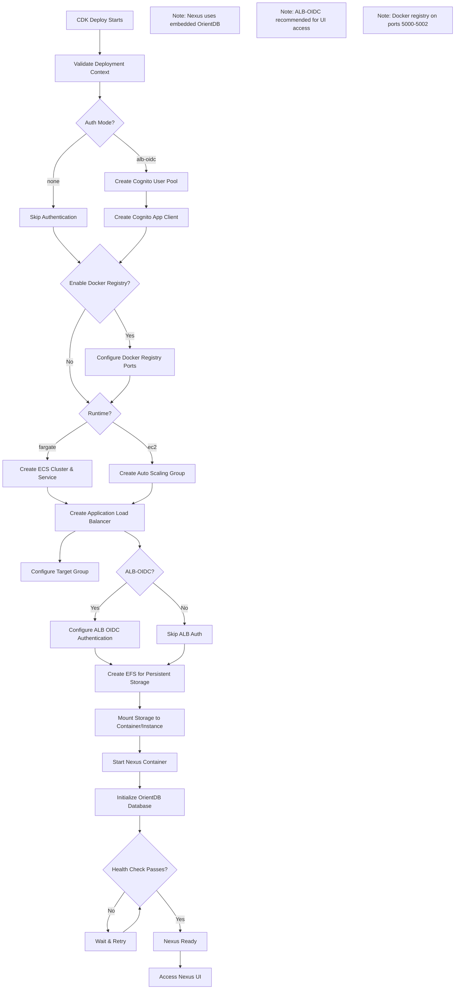
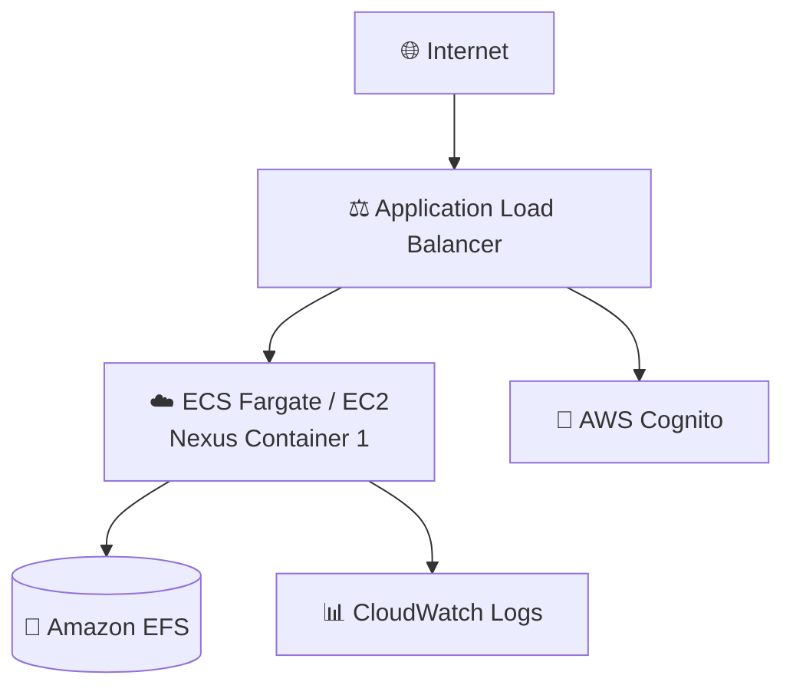

# Nexus Repository Application Guide

Nexus Repository is a universal artifact repository manager supporting Maven, npm, Docker, PyPI, and many other formats.

**Status**: Available (Not Yet Tested)

---

## Quick Reference

| Property | Value |
|----------|-------|
| **Application ID** | `nexus` |
| **Category** | Artifact Registry |
| **Default Image** | `sonatype/nexus3:latest` |
| **Application Port** | `8081` |
| **Default CPU** | 2048 (Fargate) |
| **Default Memory** | 4096 MB (Fargate) |
| **Default Instance** | t3.medium (EC2) |
| **Health Check Path** | `/` |
| **Health Check Grace** | 300 seconds |
| **Supports Fargate** | Yes |
| **Supports EC2** | Yes |
| **OIDC Support** | No (Nexus Pro feature) |
| **Database Required** | No (embedded OrientDB) |

---

## Deployment Architecture

The following AWS architecture diagram shows the complete Nexus deployment:



## Architecture Diagram

The following diagram shows the Nexus deployment architecture:



---

## Capabilities

- Universal repository manager
- Maven, Gradle, npm, NuGet, PyPI, RubyGems, Docker
- Proxy repositories (cache remote artifacts)
- Hosted repositories (store internal artifacts)
- Group repositories (aggregate multiple repos)
- Component analysis and security
- REST API
- Blob stores (local, S3)
- Repository health check

---

## Optional Ports

| Port | Protocol | Direction | Feature Flag | Description |
|------|----------|-----------|--------------|-------------|
| 5000 | TCP | Inbound | `enableDockerRegistry` | Docker Registry (group) |
| 5001 | TCP | Inbound | `enableDockerRegistry` | Docker Registry (hosted) |
| 5002 | TCP | Inbound | `enableDockerRegistry` | Docker Registry (proxy) |

**Example enabling Docker registry:**
```json
{
  "enableDockerRegistry": true
}
```

---

## Authentication

### Supported Auth Modes

| Mode | Status | Description |
|------|--------|-------------|
| `alb-oidc` | Available | ALB-level authentication |
| `none` | Available | Local accounts only |

**Note:** Native OIDC/SAML requires Nexus Pro license.

---

## Environment Variables

| Variable | Description |
|----------|-------------|
| `INSTALL4J_ADD_VM_PARAMS` | JVM memory tuning |

---

## Storage Configuration

### Container (Fargate)
| Property | Value |
|----------|-------|
| Data Path | `/nexus-data` |
| EFS Path | `/nexus` |
| Volume Name | `nexusData` |
| Container User | `200:200` |
| EFS Permissions | `755` |

### EC2
| Property | Value |
|----------|-------|
| EBS Device | `/dev/xvdh` |
| Data Path | `/opt/nexus-data` |
| Log Paths | `/opt/nexus-data/log/nexus.log`, `/opt/nexus-data/log/audit/audit.log` |

---

## Deployment Context Examples

### Development

```json
{
  "stackName": "Nexus-Dev",
  "applicationId": "nexus",
  "applicationName": "Nexus Dev",
  "description": "Nexus development repository",
  "environment": "development",

  "runtime": "fargate",
  "securityProfile": "dev",
  "topology": "application-service",

  "networkMode": "public-no-nat",
  "region": "us-east-1",

  "authMode": "none",

  "cpu": 2048,
  "memory": 4096,

  "enableMonitoring": true,
  "logRetentionDays": "7"
}
```

### Production - With Docker Registry

```json
{
  "stackName": "Nexus-Production",
  "applicationId": "nexus",
  "applicationName": "Nexus Repository",
  "description": "Production artifact repository",
  "environment": "production",

  "runtime": "ec2",
  "securityProfile": "production",
  "topology": "application-service",

  "domain": "example.com",
  "subdomain": "nexus",
  "enableSsl": true,

  "networkMode": "private-with-nat",
  "region": "us-east-1",

  "authMode": "alb-oidc",
  "cognitoAutoProvision": true,
  "cognitoDomainPrefix": "nexus-prod-yourcompany",
  "cognitoMfaEnabled": true,

  "instanceType": "t3.large",
  "minInstanceCapacity": 1,
  "maxInstanceCapacity": 2,

  "enableDockerRegistry": true,

  "complianceFrameworks": "SOC2",
  "awsConfigEnabled": true,
  "guardDutyEnabled": true,
  "wafEnabled": true,

  "enableMonitoring": true,
  "enableEncryption": true,
  "logRetentionDays": "730",
  "retainStorage": true
}
```

**Cost estimate:** ~$350/month

---

## Compliance Use Cases

- **SOC2**: Software bill of materials (SBOM) tracking
- **PCI-DSS**: Secure artifact storage for payment processing
- **HIPAA**: Audit trail for healthcare application deployments

---

## Post-Deployment Tasks

1. **Get Admin Password**:
   ```bash
   # Fargate
   aws ecs execute-command --cluster CLUSTER --task TASK --container nexus \
     --command "cat /nexus-data/admin.password"

   # EC2
   ssh ec2-user@instance 'cat /opt/nexus-data/admin.password'
   ```
2. **Change Admin Password**: First login prompts password change
3. **Create Repositories**: Maven, npm, Docker as needed
4. **Configure Blob Stores**: S3 for scalable storage
5. **Set Up Cleanup Policies**: Manage storage growth

---

## Related Documentation

- [Nexus Documentation](https://help.sonatype.com/repomanager3)
- [Compliance Guide](../../compliance/README.md)
