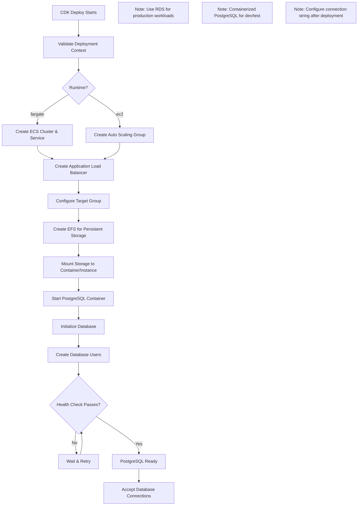
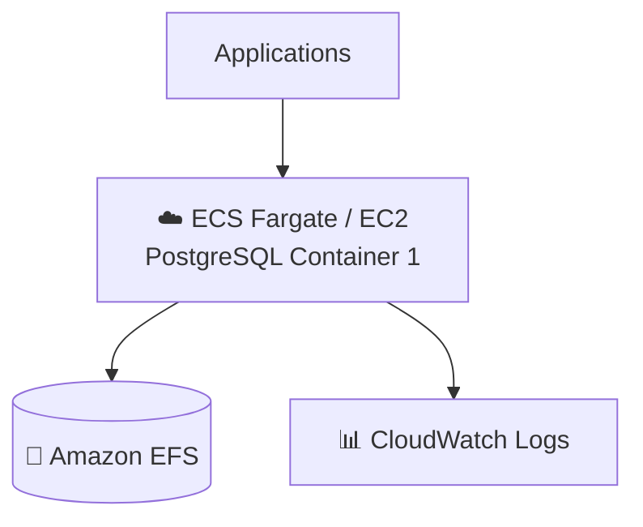

# PostgreSQL Application Guide

PostgreSQL is an advanced open-source relational database known for reliability, feature robustness, and performance.

**Status**: Available (Not Yet Tested)

---

## Quick Reference

| Property | Value |
|----------|-------|
| **Application ID** | `postgresql` |
| **Category** | Database |
| **Default Image** | `postgres:15` |
| **Application Port** | `5432` |
| **Default CPU** | 1024 (Fargate) |
| **Default Memory** | 2048 MB (Fargate) |
| **Default Instance** | t3.small (EC2) |
| **Health Check Path** | `/` |
| **Health Check Grace** | 300 seconds |
| **Supports Fargate** | Yes |
| **Supports EC2** | Yes |
| **OIDC Support** | No |
| **Database Required** | N/A (is a database) |

---

## Deployment Architecture

The following AWS architecture diagram shows the complete PostgreSQL deployment:



## Architecture Diagram

The following diagram shows the PostgreSQL deployment architecture:



---

## When to Use

Use containerized PostgreSQL for:
- Development and testing environments
- Standalone database for single applications
- Quick prototyping

For production, consider **Amazon RDS PostgreSQL** which provides:
- Automated backups
- Multi-AZ deployment
- Read replicas
- Managed patching

---

## Storage Configuration

### Container (Fargate)
| Property | Value |
|----------|-------|
| Data Path | `/var/lib/postgresql/data` |
| EFS Path | `/postgresql` |
| Volume Name | `postgresData` |
| Container User | `999:999` |
| EFS Permissions | `700` |

---

## Deployment Context Examples

### Development

```json
{
  "stackName": "PostgreSQL-Dev",
  "applicationId": "postgresql",
  "applicationName": "PostgreSQL Dev",
  "description": "PostgreSQL development database",
  "environment": "development",

  "runtime": "fargate",
  "securityProfile": "dev",
  "topology": "application-service",

  "networkMode": "private-with-nat",
  "region": "us-east-1",

  "authMode": "none",

  "cpu": 1024,
  "memory": 2048,

  "enableMonitoring": true,
  "logRetentionDays": "7"
}
```

**Cost estimate:** ~$50/month

---

## Environment Variables

| Variable | Description |
|----------|-------------|
| `POSTGRES_PASSWORD` | Generated from Secrets Manager |
| `POSTGRES_DB` | `cloudforge` |
| `POSTGRES_USER` | `cloudforge` |

---

## Compliance Considerations

Databases are **CRITICAL RISK** for compliance:
- Store sensitive data (PII, PHI, payment data)
- Require encryption at rest and in transit
- Need audit logging for all access
- Backup retention based on framework requirements

**For production compliance workloads, use Amazon RDS with:**
- Multi-AZ deployment
- Encryption enabled
- Enhanced monitoring
- Performance Insights
- Automated backups

---

## Related Documentation

- [Database Deployment Guide](../../databases/DATABASE-DEPLOYMENT-GUIDE.md)
- [PostgreSQL Documentation](https://www.postgresql.org/docs/)
