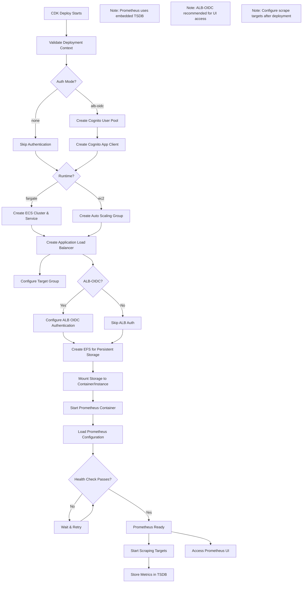
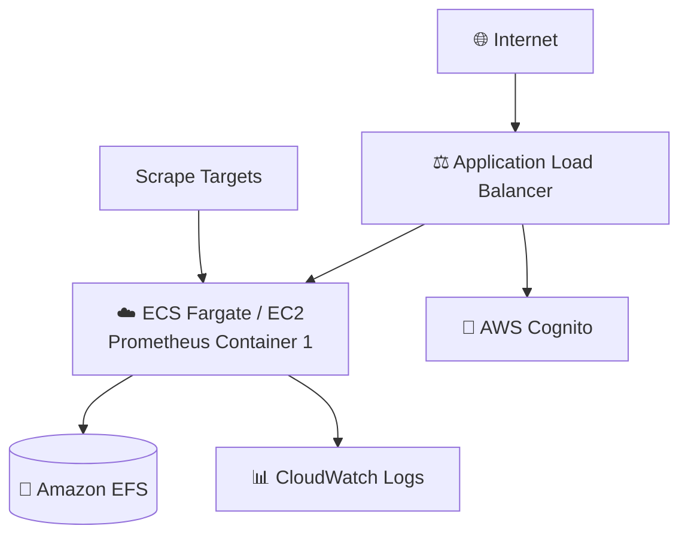

# Prometheus Application Guide

Prometheus is an open-source systems monitoring and alerting toolkit designed for reliability and scalability.

**Status**: Available (Not Yet Tested)

---

## Quick Reference

| Property | Value |
|----------|-------|
| **Application ID** | `prometheus` |
| **Category** | Monitoring |
| **Default Image** | `prom/prometheus:latest` |
| **Application Port** | `9090` |
| **Default CPU** | 1024 (Fargate) |
| **Default Memory** | 2048 MB (Fargate) |
| **Default Instance** | t3.small (EC2) |
| **Health Check Path** | `/` |
| **Health Check Grace** | 300 seconds |
| **Supports Fargate** | Yes |
| **Supports EC2** | Yes |
| **OIDC Support** | No (use ALB-OIDC) |
| **Database Required** | No (embedded TSDB) |

---

## Deployment Architecture

The following AWS architecture diagram shows the complete Prometheus deployment:



## Architecture Diagram

The following diagram shows the Prometheus deployment architecture:



---

## Capabilities

- Multi-dimensional time series data model
- PromQL query language
- Pull-based metrics collection
- Service discovery
- Alerting with Alertmanager
- Visualization (basic, use Grafana for dashboards)
- Recording rules
- Remote storage integration
- Exporters ecosystem

---

## Storage Configuration

### Container (Fargate)
| Property | Value |
|----------|-------|
| Data Path | `/prometheus` |
| EFS Path | `/prometheus` |
| Volume Name | `prometheusData` |
| Container User | `65534:65534` (nobody) |
| EFS Permissions | `755` |

---

## Deployment Context Examples

### Development

```json
{
  "stackName": "Prometheus-Dev",
  "applicationId": "prometheus",
  "applicationName": "Prometheus Dev",
  "description": "Prometheus monitoring server",
  "environment": "development",

  "runtime": "fargate",
  "securityProfile": "dev",
  "topology": "application-service",

  "networkMode": "private-with-nat",
  "region": "us-east-1",

  "authMode": "none",

  "cpu": 1024,
  "memory": 2048,

  "enableMonitoring": true,
  "logRetentionDays": "7"
}
```

**Cost estimate:** ~$50/month

### Production - With Authentication

```json
{
  "stackName": "Prometheus-Production",
  "applicationId": "prometheus",
  "applicationName": "Prometheus",
  "description": "Production monitoring server",
  "environment": "production",

  "runtime": "ec2",
  "securityProfile": "production",
  "topology": "application-service",

  "domain": "example.com",
  "subdomain": "prometheus",
  "enableSsl": true,

  "networkMode": "private-with-nat",
  "region": "us-east-1",

  "authMode": "alb-oidc",
  "cognitoAutoProvision": true,
  "cognitoDomainPrefix": "prometheus-prod-yourcompany",
  "cognitoMfaEnabled": true,

  "instanceType": "t3.medium",
  "minInstanceCapacity": 1,
  "maxInstanceCapacity": 2,

  "complianceFrameworks": "SOC2",
  "awsConfigEnabled": true,
  "wafEnabled": true,

  "enableMonitoring": true,
  "enableEncryption": true,
  "logRetentionDays": "365",
  "retainStorage": true
}
```

**Cost estimate:** ~$200/month

---

## Configuration

Default `prometheus.yml`:
```yaml
global:
  scrape_interval: 15s
  evaluation_interval: 15s

scrape_configs:
  - job_name: 'prometheus'
    static_configs:
      - targets: ['localhost:9090']
```

---

## Post-Deployment Tasks

1. **Configure Scrape Targets**: Edit prometheus.yml
2. **Add Exporters**: Node Exporter, CloudWatch Exporter, etc.
3. **Set Up Alerting**: Configure Alertmanager
4. **Connect Grafana**: Add as data source

---

## Related Documentation

- [Grafana Guide](grafana.md) - Visualization
- [Prometheus Documentation](https://prometheus.io/docs/)
