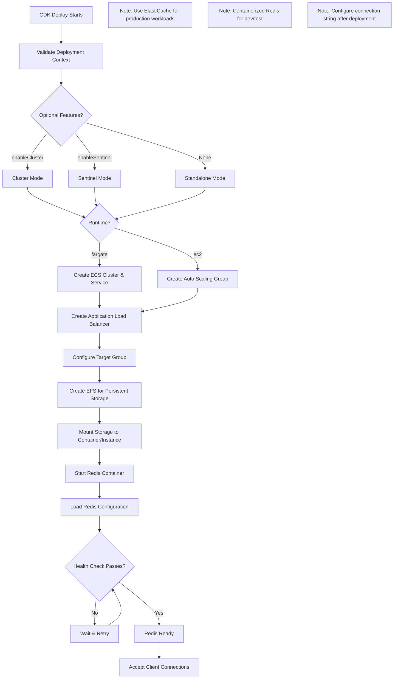
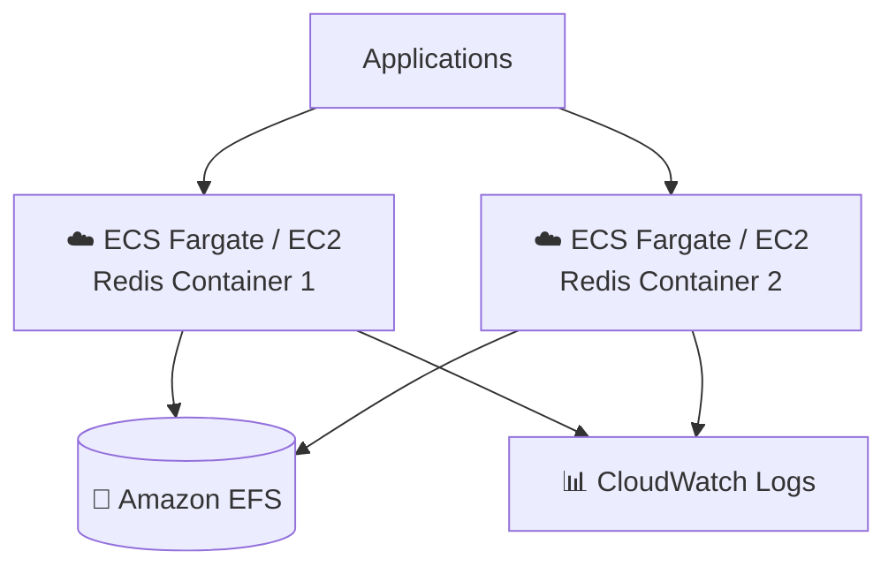

# Redis Application Guide

Redis is an in-memory data structure store used as a database, cache, message broker, and queue.

**Status**: Available (Not Yet Tested)

---

## Quick Reference

| Property | Value |
|----------|-------|
| **Application ID** | `redis` |
| **Category** | Database |
| **Default Image** | `redis:7-alpine` |
| **Application Port** | `6379` |
| **Default CPU** | 512 (Fargate) |
| **Default Memory** | 1024 MB (Fargate) |
| **Default Instance** | t3.micro (EC2) |
| **Health Check Path** | `/` |
| **Health Check Grace** | 300 seconds |
| **Supports Fargate** | Yes |
| **Supports EC2** | Yes |
| **OIDC Support** | No |
| **Database Required** | N/A |

---

## Deployment Architecture

The following AWS architecture diagram shows the complete Redis deployment:



## Architecture Diagram

The following diagram shows the Redis deployment architecture:



---

## When to Use

Use containerized Redis for:
- Development and testing
- Session storage
- Caching layer
- Message queuing

For production, consider **Amazon ElastiCache for Redis** which provides:
- Automatic failover
- Multi-AZ deployment
- Read replicas
- Managed patching

---

## Optional Ports

| Port | Protocol | Direction | Feature Flag | Description |
|------|----------|-----------|--------------|-------------|
| 16379 | TCP | Inbound | `enableCluster` | Cluster Bus |
| 26379 | TCP | Inbound | `enableSentinel` | Sentinel |

---

## Storage Configuration

### Container (Fargate)
| Property | Value |
|----------|-------|
| Data Path | `/data` |
| EFS Path | `/redis` |
| Volume Name | `redisData` |
| Container User | `999:999` |
| EFS Permissions | `755` |

---

## Deployment Context Examples

### Development

```json
{
  "stackName": "Redis-Dev",
  "applicationId": "redis",
  "applicationName": "Redis Dev",
  "description": "Redis development cache",
  "environment": "development",

  "runtime": "fargate",
  "securityProfile": "dev",
  "topology": "application-service",

  "networkMode": "private-with-nat",
  "region": "us-east-1",

  "authMode": "none",

  "cpu": 512,
  "memory": 1024,

  "enableMonitoring": true,
  "logRetentionDays": "7"
}
```

**Cost estimate:** ~$30/month

---

## Related Documentation

- [Database Deployment Guide](../../databases/DATABASE-DEPLOYMENT-GUIDE.md)
- [Redis Documentation](https://redis.io/docs/)
