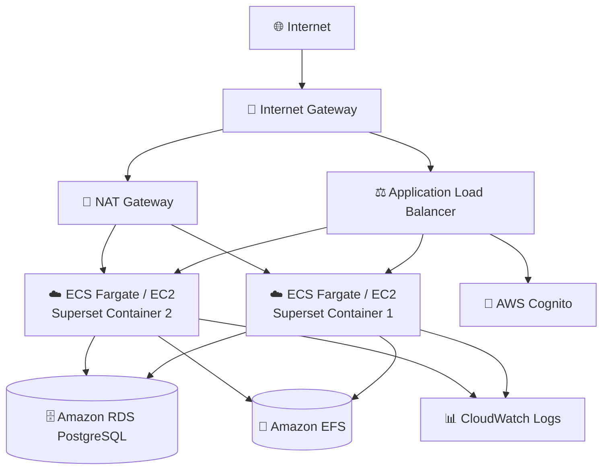
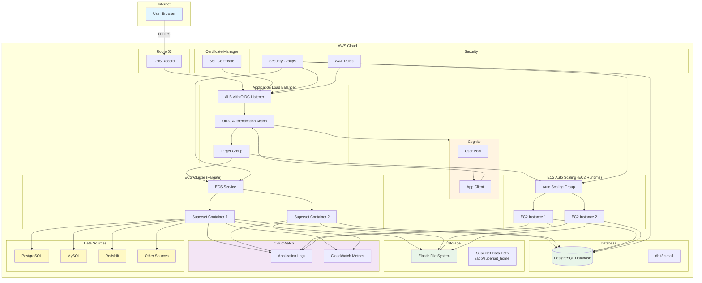

# Superset Application Guide

Apache Superset is a modern data exploration and visualization platform that enables users to explore and visualize their data from simple charts to highly detailed dashboards.

**Status**: Verified (Deployment tested)

---

## Quick Reference

| Property | Value |
|----------|-------|
| **Application ID** | `superset` |
| **Category** | Analytics |
| **Default Image** | `apache/superset:latest` |
| **Application Port** | `8088` |
| **Default CPU** | 1024 (Fargate) |
| **Default Memory** | 2048 MB (Fargate) |
| **Default Instance** | t3.small (EC2) |
| **Health Check Path** | `/` |
| **Health Check Grace** | 300 seconds |
| **Supports Fargate** | Yes |
| **Supports EC2** | Yes |
| **OIDC Support** | `alb-oidc` only (application-level not implemented) |
| **Database Required** | Yes (PostgreSQL) |

---

## Deployment Architecture

The following AWS architecture diagram shows the complete Superset deployment:



## Architecture Diagram

The following diagram shows the Superset deployment architecture:



---

## Capabilities

- SQL-based data exploration
- Rich visualizations (40+ chart types)
- Dashboard creation
- SQL Lab for ad-hoc queries
- Role-based access control
- Database connectivity (30+ databases)
- Caching with Redis
- Alerting and reports
- No-code chart builder
- Semantic layer

---

## Database Requirements

Superset **requires** a PostgreSQL (or MySQL) database for metadata storage.

| Property | Value |
|----------|-------|
| Engine | PostgreSQL 13+ |
| Instance Class | db.t3.small (default) |
| Storage | 20 GB (default) |
| Database Name | `superset` |
| Backup Retention | 14 days |

---

## Authentication

### Supported Auth Modes

| Mode | Status | Description |
|------|--------|-------------|
| `alb-oidc` | ✅ Verified | ALB-level authentication (Recommended) |
| `application-oidc` | ❌ Not Implemented | Requires custom `superset_config.py` configuration |
| `none` | ✅ Available | Local accounts only |

### Authentication Notes

**Application-level OIDC (`application-oidc`) is not implemented:**
- Apache Superset supports OIDC via custom `superset_config.py` configuration
- CloudForge does not currently auto-configure Superset's OIDC integration
- **Workaround:** Use `alb-oidc` mode for SSO authentication (works correctly)

**ALB-OIDC Details:**
When using `authMode: "alb-oidc"`:
- Authentication happens at the load balancer
- Users are automatically created in Superset on first access
- User email is passed from Cognito to Superset
- No additional Superset configuration required

---

## Environment Variables

| Variable | Description |
|----------|-------------|
| `SUPERSET_SECRET_KEY` | Session encryption key (required) |
| `ENABLE_PROXY_FIX` | Enable ALB proxy support |
| `DATABASE_DIALECT` | `postgresql` |
| `DATABASE_HOST` | RDS endpoint |
| `SQLALCHEMY_DATABASE_URI` | Full connection string |

---

## Storage Configuration

### Container (Fargate)
| Property | Value |
|----------|-------|
| Data Path | `/app/superset_home` |
| EFS Path | `/superset` |
| Volume Name | `supersetData` |
| Container User | `0:0` (root) |
| EFS Permissions | `755` |

---

## Deployment Context Examples

### Development

```json
{
  "stackName": "Superset-Dev",
  "applicationId": "superset",
  "applicationName": "Superset Dev",
  "description": "Superset development environment",
  "environment": "development",

  "runtime": "fargate",
  "securityProfile": "dev",
  "topology": "application-service",

  "networkMode": "private-with-nat",
  "region": "us-east-1",

  "authMode": "none",

  "cpu": 1024,
  "memory": 2048,

  "provisionDatabase": true,
  "databaseEngine": "postgres",
  "databaseVersion": "15",
  "databaseInstanceClass": "db.t3.micro",
  "databaseAllocatedStorageGB": 20,
  "databaseName": "superset",

  "enableMonitoring": true,
  "logRetentionDays": "7"
}
```

**Cost estimate:** ~$70/month

### Production

```json
{
  "stackName": "Superset-Production",
  "applicationId": "superset",
  "applicationName": "Superset Analytics",
  "description": "Production data exploration platform",
  "environment": "production",

  "runtime": "ec2",
  "securityProfile": "production",
  "topology": "application-service",

  "domain": "example.com",
  "subdomain": "data",
  "enableSsl": true,

  "networkMode": "private-with-nat",
  "region": "us-east-1",

  "authMode": "alb-oidc",
  "cognitoAutoProvision": true,
  "cognitoDomainPrefix": "superset-prod-yourcompany",
  "cognitoMfaEnabled": true,

  "instanceType": "t3.medium",
  "minInstanceCapacity": 2,
  "maxInstanceCapacity": 4,
  "enableAutoScaling": true,

  "provisionDatabase": true,
  "databaseEngine": "postgres",
  "databaseVersion": "15",
  "databaseInstanceClass": "db.t3.medium",
  "databaseAllocatedStorageGB": 50,
  "databaseMultiAz": true,
  "databaseName": "superset",
  "databaseBackupRetentionDays": 30,

  "complianceFrameworks": "SOC2",
  "awsConfigEnabled": true,
  "guardDutyEnabled": true,
  "wafEnabled": true,

  "enableMonitoring": true,
  "enableEncryption": true,
  "logRetentionDays": "730",
  "retainStorage": true
}
```

**Cost estimate:** ~$350/month

---

## Post-Deployment Tasks

1. **Initialize Database:**
   ```bash
   superset db upgrade
   ```
2. **Create Admin User:**
   ```bash
   superset fab create-admin
   ```
3. **Load Examples (optional):**
   ```bash
   superset load_examples
   ```
4. **Initialize Superset:**
   ```bash
   superset init
   ```
5. **Connect Data Sources** in the UI

---

## Compliance Use Cases

- **SOC2**: Security event analytics and metrics
- **GDPR**: Data subject rights request tracking
- **PCI-DSS**: Transaction monitoring dashboards
- **Fintech**: Real-time payment dashboards, fraud detection

---

## Related Documentation

- [Database Deployment Guide](../../databases/DATABASE-DEPLOYMENT-GUIDE.md)
- [Superset Documentation](https://superset.apache.org/docs/intro)
