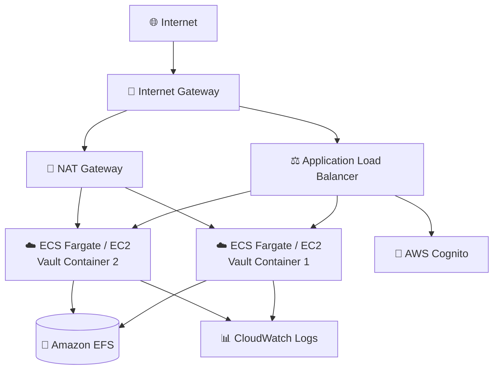
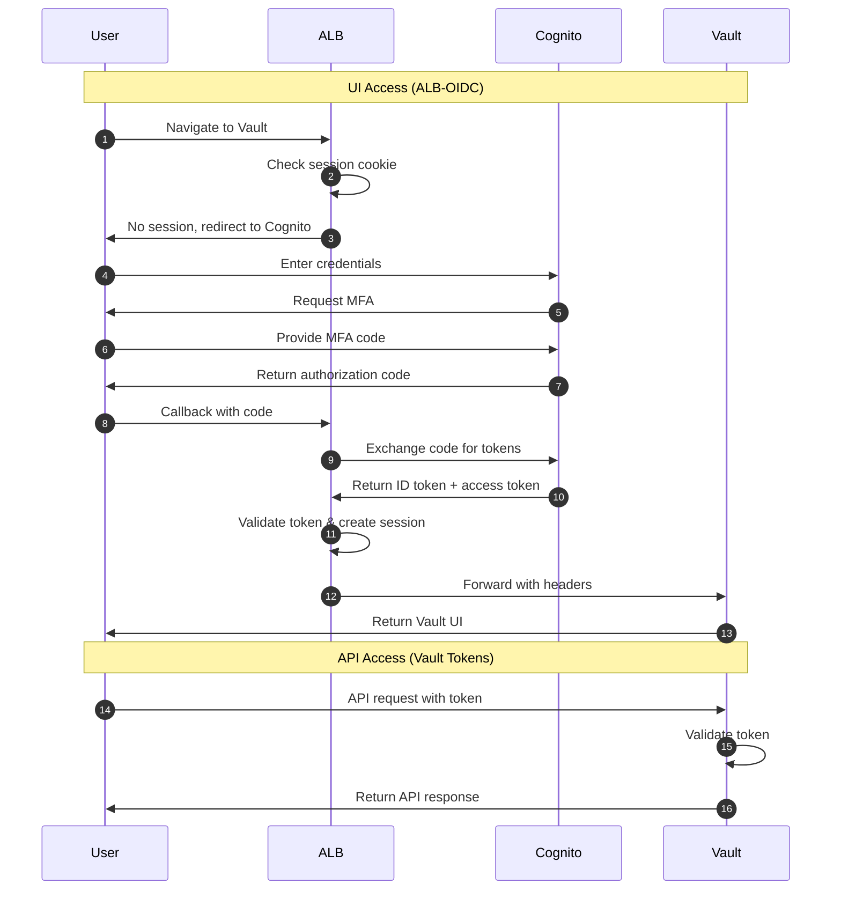
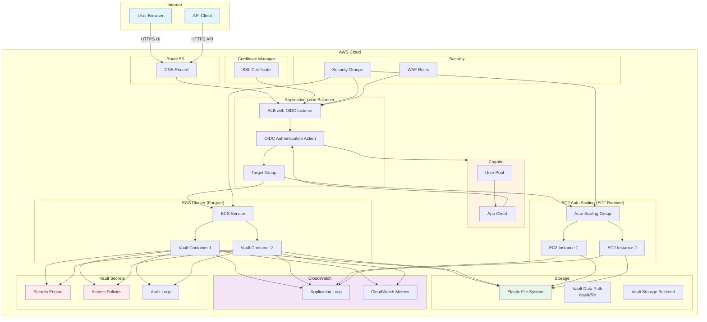

# Vault Application Guide

HashiCorp Vault is a tool for securely storing and accessing secrets, providing encryption as a service, and managing access to secrets and systems.

**Status**: Available (Not Yet Tested)

---

## Quick Reference

| Property | Value |
|----------|-------|
| **Application ID** | `vault` |
| **Category** | Secrets Management |
| **Default Image** | `hashicorp/vault:latest` |
| **Application Port** | `8200` |
| **Default CPU** | 1024 (Fargate) |
| **Default Memory** | 2048 MB (Fargate) |
| **Default Instance** | t3.small (EC2) |
| **Health Check Path** | `/` |
| **Health Check Grace** | 300 seconds |
| **Supports Fargate** | Yes |
| **Supports EC2** | Yes (recommended) |
| **OIDC Support** | No (use ALB-OIDC) |
| **Database Required** | No |

---

## Deployment Architecture

The following AWS architecture diagram shows the complete Vault deployment:



## Authentication Flow

Vault uses ALB-OIDC for UI access and Vault tokens for API access:



## Architecture Diagram

The following diagram shows the Vault deployment architecture:



---

## Capabilities

- Secret storage and management
- Dynamic secrets generation
- Encryption as a service
- PKI/certificate authority
- Database credential rotation
- AWS IAM credential management
- Kubernetes secrets sync
- Audit logging
- Access policies

---

## Storage Configuration

### Container (Fargate)
| Property | Value |
|----------|-------|
| Data Path | `/vault/file` |
| EFS Path | `/vault` |
| Volume Name | `vaultData` |
| Container User | `100:1000` |
| EFS Permissions | `750` |

### EC2
| Property | Value |
|----------|-------|
| EBS Device | `/dev/xvdh` |
| Data Path | `/opt/vault/data` |
| Log Paths | `/var/log/vault/vault.log`, `/var/log/vault/audit.log` |

---

## Deployment Context Examples

### Development

```json
{
  "stackName": "Vault-Dev",
  "applicationId": "vault",
  "applicationName": "Vault Dev",
  "description": "Vault development secrets manager",
  "environment": "development",

  "runtime": "fargate",
  "securityProfile": "dev",
  "topology": "application-service",

  "networkMode": "private-with-nat",
  "region": "us-east-1",

  "authMode": "none",

  "cpu": 1024,
  "memory": 2048,

  "enableMonitoring": true,
  "logRetentionDays": "7"
}
```

**Cost estimate:** ~$50/month

### Production - With Auto-Unseal

For production, EC2 with KMS auto-unseal is recommended:

```json
{
  "stackName": "Vault-Production",
  "applicationId": "vault",
  "applicationName": "Vault",
  "description": "Production secrets management",
  "environment": "production",

  "runtime": "ec2",
  "securityProfile": "production",
  "topology": "application-service",

  "domain": "example.com",
  "subdomain": "vault",
  "enableSsl": true,

  "networkMode": "private-with-nat",
  "region": "us-east-1",

  "authMode": "alb-oidc",
  "cognitoAutoProvision": true,
  "cognitoDomainPrefix": "vault-prod-yourcompany",
  "cognitoMfaEnabled": true,

  "instanceType": "t3.small",
  "minInstanceCapacity": 3,
  "maxInstanceCapacity": 5,

  "complianceFrameworks": "SOC2,PCI-DSS",
  "awsConfigEnabled": true,
  "guardDutyEnabled": true,
  "wafEnabled": true,

  "enableMonitoring": true,
  "enableEncryption": true,
  "logRetentionDays": "730",
  "retainStorage": true
}
```

**Cost estimate:** ~$300/month

---

## Important Notes

### Initialization and Unsealing

Vault requires **manual initialization** after first deployment:

1. **Initialize Vault:**
   ```bash
   vault operator init
   ```
   Save the unseal keys and root token securely!

2. **Unseal Vault:**
   ```bash
   vault operator unseal <key1>
   vault operator unseal <key2>
   vault operator unseal <key3>
   ```

### Production Recommendations

- Use **KMS auto-unseal** to avoid manual unsealing
- Deploy **minimum 3 instances** for HA
- Enable **audit logging** for compliance
- Use **Integrated Storage (Raft)** for clustering
- Store unseal keys in **separate secure locations**

---

## Compliance Use Cases

- **PCI-DSS**: Payment gateway API key storage
- **HIPAA**: PHI encryption key management
- **SOC2**: Centralized secrets and audit trails
- **GDPR**: Data encryption key rotation

---

## Related Documentation

- [Compliance Guide](../../compliance/README.md)
- [Vault Documentation](https://developer.hashicorp.com/vault/docs)
